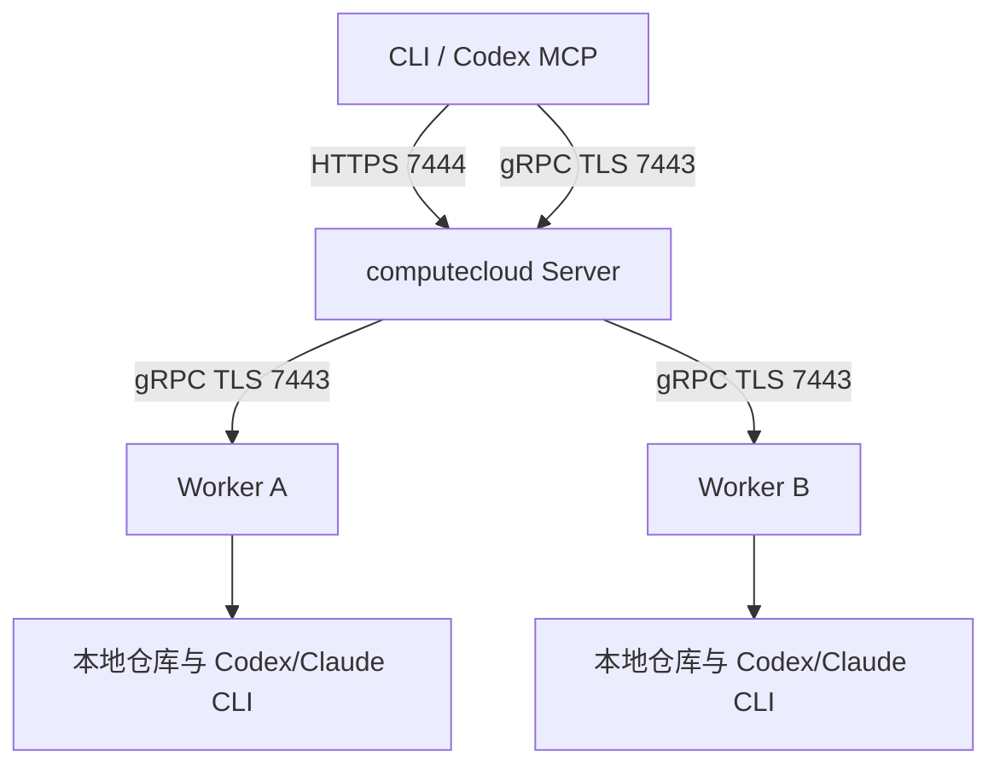

# computecloud v0.2.0 正式部署指南

本文用于在受信 Linux 主机上部署一个活动 Server 和一个或多个 Worker。控制面与各 Worker 分别使用本机 SQLite，不需要 PostgreSQL、Redis、消息队列或共享文件系统。v0.2.0 面向批处理、single Job 和显式 Map/Reduce；自动重试、控制面高可用、容器隔离、历史 GC 和交互式 Session 不在本版本范围内。

## 1. 部署拓扑与端口



- Server：单活动实例，开放 TCP 7443（gRPC）和 7444（Job HTTP/MCP；可按配置修改）。
- Worker：只需主动访问 Server 7443，不接受平台入站连接。
- 调用方：Job CLI/MCP 使用 7444；旧 Task CLI 和 Worker 控制流使用 7443。
- HTTP 和 gRPC 共用 Server 证书。当前通过 TLS 加 Bearer Token 鉴权，不使用客户端证书。
- 数据目录必须位于各自主机的本地持久磁盘；禁止两个 Server 共享一个 SQLite 目录。

## 2. 下载并核验正式产物

根据 `uname -m` 选择架构：`x86_64` 对应 `amd64`，`aarch64` 对应 `arm64`。

```sh
version=0.2.0
arch=amd64
base=https://github.com/tommyxie2026-tech/computecloud/releases/download/v${version}

curl --fail --location --remote-name "${base}/computecloud_${version}_linux_${arch}.tar.gz"
curl --fail --location --remote-name "${base}/SHA256SUMS"
sha256sum --ignore-missing -c SHA256SUMS
tar -xzf "computecloud_${version}_linux_${arch}.tar.gz"
sudo install -o root -g root -m 0755 \
  "computecloud_${version}_linux_${arch}/computecloud" /usr/local/bin/computecloud
computecloud version
```

期望版本前缀为 `computecloud 0.2.0`。校验失败、架构不匹配或版本不符时停止部署。压缩包同时包含 README、CHANGELOG、DEPLOYMENT 和 `examples/`。

## 3. 主机账户与目录

Server 和 Worker 建议使用不同的非登录账户；每个 Worker 使用独立账户和数据目录。以下分别在对应主机执行：

```sh
# Server 主机
sudo useradd --system --user-group --home-dir /var/lib/computecloud-server --shell /usr/sbin/nologin computecloud
sudo install -d -o computecloud -g computecloud -m 0700 /var/lib/computecloud-server
sudo install -d -o root -g computecloud -m 0750 /etc/computecloud
sudo install -d -o root -g computecloud -m 0750 /etc/computecloud/secrets

# 每台 Worker 主机；该账户需要能够运行并登录 Codex/Claude CLI。
sudo useradd --system --user-group --create-home --home-dir /var/lib/computecloud-worker \
  --shell /bin/bash computecloud-worker
sudo install -d -o computecloud-worker -g computecloud-worker -m 0700 /var/lib/computecloud-worker/data
sudo install -d -o root -g computecloud-worker -m 0750 /etc/computecloud
sudo install -d -o root -g computecloud-worker -m 0750 /etc/computecloud/secrets
```

仓库白名单中的源仓库使用固定绝对路径。Worker 账户只需读取源仓库，运行工作区由 computecloud 在 Worker 数据目录内创建。Codex/Claude CLI、Git、项目验证工具和所需 CA 必须预先安装。

## 4. TLS 与 Token

使用组织 PKI 为 Server 签发服务器证书，SAN 必须包含 Worker `server_address` 和客户端 URL 使用的 DNS 名称。Server 保存证书和私钥；Worker/客户端保存签发 CA。生产配置不得使用 `insecure_loopback`。

每个用户和每个 Worker 使用独立的随机 Token。Server 保存所有 Token 的本地副本，Worker 或客户端只保存自己的副本：

```sh
umask 077
openssl rand -hex 32 > task.token
openssl rand -hex 32 > worker-a.token
```

将文件安全分发到对应主机的 `/etc/computecloud/secrets/`，设置为服务账户可读、其他账户不可读。Token 至少 24 个字符；轮换时先在 Server 和对应节点同时准备新文件，再在维护窗口重启。模型 API Key 与 Job Token 分离，不写入 YAML、Git、Job 输入或日志。

## 5. Worker 配置与模板摘要

先配置 Worker，再生成 Server 信任的模板摘要。`version` 必须是目标账户实际执行 `codex --version` 或 `claude --version` 的完整输出；模型、仓库和凭据名称按环境替换。

```yaml
worker:
  id: worker-a
  server_address: computecloud.example.internal:7443
  data_dir: /var/lib/computecloud-worker/data
  token_file: /etc/computecloud/secrets/worker-a.token
  tls:
    ca_file: /etc/computecloud/ca.crt
  slots: 2
  stop_grace_ms: 3000
  repositories:
    production-repo: /srv/computecloud/repos/production-repo
  runtimes:
    codex_exec:
      executable: /usr/local/bin/codex
      version: REPLACE_WITH_EXACT_CODEX_VERSION_OUTPUT
      models: [REPLACE_WITH_CODEX_MODEL]
      credentials: [codex-account]
    claude_print:
      executable: /usr/local/bin/claude
      version: REPLACE_WITH_EXACT_CLAUDE_VERSION_OUTPUT
      models: [REPLACE_WITH_CLAUDE_MODEL]
      credentials: [claude-account]
  policies:
    inspect-v1:
      codex_sandbox: read-only
      claude_permission_mode: dontAsk
      claude_allowed_tools: [Read, Glob, Grep]
  verifiers:
    report-v1: []
    findings-v1: []
    merged-report-v1: []
```

配置 CLI 登录或 `credential_env` 后，以 Worker 服务账户验证版本和真实只读调用。生成模板：

```sh
sudo -u computecloud-worker computecloud templates --config /etc/computecloud/worker.yaml \
  > /tmp/worker-a-templates.json
```

所有能够接收同类任务的 Worker，其运行时版本、策略和 verifier argv 必须得到相同摘要。审阅输出后，把需要的 `templates` 项复制到 Server 配置；不要从节点注册信息自动信任未知模板。补丁任务另建可写策略和真实测试 verifier。

## 6. Server 与客户端配置

Server 示例：

```yaml
server:
  listen: 0.0.0.0:7443
  http:
    listen: 0.0.0.0:7444
    allowed_origins: []
  data_dir: /var/lib/computecloud-server
  tls:
    cert_file: /etc/computecloud/server.crt
    key_file: /etc/computecloud/secrets/server.key
  lease_seconds: 60
  tick_ms: 500
  max_artifact_bytes: 33554432
  max_project_tasks: 8
  maintenance: false
  models:
    codex_exec: REPLACE_WITH_CODEX_MODEL
    claude_print: REPLACE_WITH_CLAUDE_MODEL
  credentials:
    codex-account: 2
    claude-account: 2
  users:
    - token_file: /etc/computecloud/secrets/task.token
      owner: operator
      projects: [production]
      credentials: [codex-account, claude-account]
      scopes: [jobs:submit, jobs:read, jobs:cancel]
  workers:
    - token_file: /etc/computecloud/secrets/worker-a.token
      worker_id: worker-a
      projects: [production]
      credentials: [codex-account, claude-account]
  jobs:
    enabled: true
    max_partitions: 32
    max_parallelism: 8
    recommended_parallelism: 2
    max_request_bytes: 262144
    max_manifest_bytes: 32768
    max_reduce_input_bytes: 134217728
    max_attempts_per_task: 1
    templates: REPLACE_WITH_REVIEWED_TEMPLATE_ARRAY
  mcp:
    enabled: true
    path: /mcp
  model_gateway:
    enabled: false
```

`templates` 必须是 YAML 数组，不能保留示例字符串。G1 模型网关在真实上游完成兼容性和账单验收前保持关闭。

运维客户端配置：

```yaml
client:
  address: computecloud.example.internal:7443
  http_url: https://computecloud.example.internal:7444
  token_file: /etc/computecloud/secrets/task.token
  tls:
    ca_file: /etc/computecloud/ca.crt
```

## 7. systemd 服务

Server `/etc/systemd/system/computecloud-server.service`：

```ini
[Unit]
Description=computecloud server
After=network-online.target
Wants=network-online.target

[Service]
Type=simple
User=computecloud
Group=computecloud
UMask=0077
ExecStart=/usr/local/bin/computecloud server --config /etc/computecloud/server.yaml
Restart=on-failure
RestartSec=5s
TimeoutStopSec=30s
KillMode=control-group
NoNewPrivileges=true
PrivateTmp=true
ProtectSystem=full
LimitNOFILE=65536

[Install]
WantedBy=multi-user.target
```

Worker `/etc/systemd/system/computecloud-worker.service`：

```ini
[Unit]
Description=computecloud worker
After=network-online.target
Wants=network-online.target

[Service]
Type=simple
User=computecloud-worker
Group=computecloud-worker
WorkingDirectory=/var/lib/computecloud-worker
UMask=0077
Environment=PATH=/usr/local/bin:/usr/bin:/bin
Environment=HOME=/var/lib/computecloud-worker
ExecStart=/usr/local/bin/computecloud worker --config /etc/computecloud/worker.yaml
Restart=on-failure
RestartSec=5s
TimeoutStopSec=30s
KillMode=control-group
NoNewPrivileges=true
PrivateTmp=true
ProtectSystem=full
LimitNOFILE=65536

[Install]
WantedBy=multi-user.target
```

若 CLI 需要额外 PATH、HOME、代理或证书变量，在 Worker unit 中显式配置并保护 drop-in 文件。先用同一服务账户完成真实 CLI 验收；过度限制 HOME 或仓库读取会导致运行时不可用。

## 8. 启动与验收

```sh
# Server 主机
sudo systemctl daemon-reload
sudo systemctl enable --now computecloud-server
sudo journalctl -u computecloud-server -n 100 --no-pager

# 每台 Worker
sudo systemctl daemon-reload
sudo systemctl enable --now computecloud-worker
sudo journalctl -u computecloud-worker -n 100 --no-pager

# 运维客户端
computecloud workers --config /etc/computecloud/client.yaml
computecloud job capabilities --config /etc/computecloud/client.yaml
```

至少完成以下验收后再开放正式提交：

1. 只出现已配置的 Worker ID，节点在线，能力和模板摘要匹配。
2. 使用固定 Git commit 提交一个 single Job，重复相同幂等键得到同一 Job ID。
3. 提交一个两分片报告 Map/Reduce，确认分片落到预期 Worker，最终事件连续、产物 SHA-256 正确。
4. 取消一个专用慢任务，确认 CLI 子进程被清理，Job 到达 CANCELED。
5. 在测试任务上重启一台 Worker 和 Server，确认租约停止、恢复和额度行为符合验证矩阵。
6. 检查 Server/Worker 数据目录权限、磁盘余量、时间同步和日志中无 Token/API Key。

HTTP/MCP 没有匿名健康接口；`job capabilities` 是带鉴权的应用级检查。服务日志使用 journald，SQLite、WAL、产物和工作区磁盘用量由主机监控采集。

## 9. 防火墙与安全基线

- 7443 只允许 Worker 网段和必要的旧 Task 运维客户端访问。
- 7444 只允许 Job/MCP 调用方或内部反向代理访问；不使用浏览器时保持 `allowed_origins: []`。
- Token、私钥、CLI 登录目录和上游 Key 权限设为 0600/0700，不放入 Server 备份包或 Git。
- 每个 Worker、调用方和模型入口使用独立 Token，按 project、credential 和 scope 最小授权。
- Worker 属于受信执行节点；v0.2.0 的进程组与工作区隔离不等同于恶意多租户沙箱。
- 固定仓库引用、commit、CLI 版本、模型和 verifier argv；升级任一项后重新生成模板并验收。

## 10. 备份、升级与回退

升级前将 `maintenance` 设为 true 并重启 Server，停止新提交和派发；根据业务提交记录确认所有 Job 已结束或取消且 Attempt 已释放，然后停止 Worker 和 Server：

```sh
sudo systemctl stop computecloud-worker
sudo systemctl stop computecloud-server
sudo -u computecloud computecloud backup \
  --data-dir /var/lib/computecloud-server \
  --out /var/backups/computecloud-server-$(date +%Y%m%d%H%M%S).tar.gz
```

另行备份 Server/Worker 配置、证书、Token 和 Worker 数据目录；不要在线复制 `state.db`。核验新包校验和，保留旧二进制和备份，再替换 `/usr/local/bin/computecloud`。先以 maintenance 模式启动 Server，检查日志和能力，然后依次启动 Worker，最后关闭 maintenance 并重启 Server。

回退时停止服务，将旧二进制与升级前完整备份恢复到新的空目录，再调整 `data_dir`。旧二进制不能直接打开已迁移的新数据库，禁止手工降低 `PRAGMA user_version`。一个数据目录任何时候只允许一个进程持有。

## 11. 发布验收记录

每次部署记录 Release 标签、二进制 SHA-256、Server/Worker 主机与 OS、CLI/模型版本、模板摘要、配置摘要、备份位置、Job/Task/Attempt ID、故障注入时间和验收结论。不得记录 Token、API Key 或未脱敏的任务输入。真实双机和真实模型仍按[多节点 PoC](../validation/multi-node-poc.md)与[容量验收](../validation/capacity.md)执行，fixture 结果不能替代目标环境验收。
