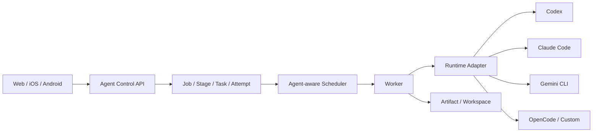
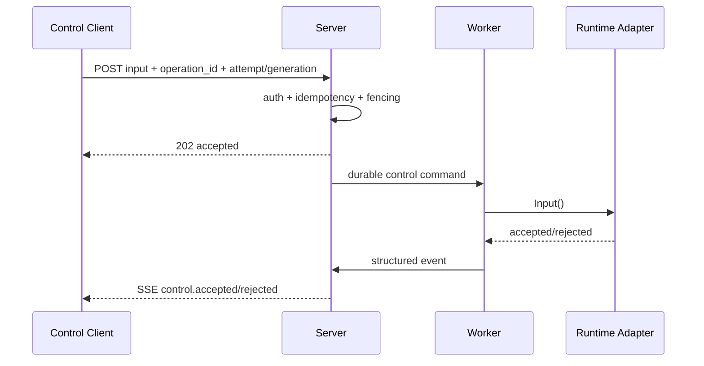

# Agent Control Protocol 与 Runtime Adapter 设计

- 项目：computecloud
- 日期：2026-09-28
- 状态：目标设计
- 上位设计：[Control 客户端控制面](./client-control-plane.md)
- 调研依据：[Agent 客户端控制端方案调研](../research/agent-control-client-landscape-2026.md)
- 路线依据：[长期路线图](../implementation/long-term-roadmap.md)
- 实施计划：[Agent Control Protocol 实施计划](../implementation/agent-control-protocol-plan.md)

## 1. 目的

本文定义 computecloud 在 Web / iOS / Android Control Client 与 Codex、Claude Code、Gemini CLI、OpenCode、自研 Agent 之间的稳定协议边界。

核心目标不是统一模型 Chat API，而是统一 **Agent Runtime Control**：

```text
Client
  -> Agent Control API
  -> Agent Job Server
  -> Runtime Adapter
  -> Worker
  -> Codex / Claude Code / Gemini / Other
```

客户端不能感知某个 CLI 的私有协议细节；Runtime Adapter 不能绕过 Job / Task / Attempt 的可靠性语义。

## 2. 核心边界

### 2.1 Control Protocol 负责

- Session 创建、恢复和生命周期观察；
- Runtime capability negotiation；
- 结构化事件流；
- Prompt/Input；
- Approval；
- Interrupt/Cancel；
- Plan / Diff / File / Artifact 查询；
- 控制操作幂等；
- Attempt generation fencing；
- 版本协商与兼容性。

### 2.2 Control Protocol 不负责

- Job 调度算法；
- Worker 选址；
- 模型路由/推理网关；
- 通用 Workflow Engine；
- Runtime 私有凭据保存；
- 用 PTY 文本推断权威任务状态；
- 在客户端实现第二套状态机。

## 3. 架构



关键约束：

1. Agent Control API 是客户端协议边界。
2. Job / Task / Attempt 仍是服务端事实源。
3. SessionRef 是 Runtime capability，不升级为新的顶级调度对象。
4. Adapter 把 Runtime-native 事件规范化为 Control Event。
5. Scheduler 只消费 capability，不出现 `if runtime == codex` 之类名称分支。

## 4. 领域模型

### 4.1 AgentSession

```text
AgentSession
  session_id
  job_id
  task_id
  attempt_id
  generation
  worker_id
  runtime
  runtime_version
  runtime_session_ref
  state
  capabilities[]
  created_at
  updated_at
```

不变式：

- `attempt_id + generation` 决定 Session 的权威执行代次。
- Runtime-native session id 只能放在 `runtime_session_ref`。
- Session resume 必须显式指定当前 SessionRef，禁止“resume last”。
- 新 Attempt 不得继承旧 Attempt 的写权限。

### 4.2 RuntimeCapability

首批稳定 capability：

```text
stream_output
structured_output
session_resume
interactive_input
queue_next_input
steer_current
approval
interrupt
cancel
plan
diff
file_read
file_write
terminal
tool_events
usage
artifact_export
```

capability 必须来自 Runtime Provider 实际探测/声明，不允许 UI 根据 runtime 名称猜测。

### 4.3 ApprovalRequest

```text
approval_id
job_id
task_id
attempt_id
generation
session_id
tool
action
risk_class
arguments_summary
policy_context
request_version
requested_at
expires_at
state
```

审批响应必须携带：

```text
operation_id
approval_id
request_version
expected_attempt_id
expected_generation
decision
```

### 4.4 ControlOperation

所有有副作用的控制动作都进入统一回执模型：

```text
principal_id
operation_id
operation_type
resource_type
resource_id
request_hash
expected_attempt_id
expected_generation
expected_resource_version
state
receipt
created_at
completed_at
```

相同 `principal_id + operation_id`：
- 同参数：返回原回执；
- 异参数：`OPERATION_CONFLICT`。

## 5. Event Protocol

### 5.1 事件信封

```json
{
  "protocol_version": "control.v1alpha1",
  "event_id": "evt_xxx",
  "seq": 12345,
  "job_id": "job_xxx",
  "task_id": "task_xxx",
  "attempt_id": "attempt_xxx",
  "generation": 2,
  "session_id": "session_xxx",
  "type": "approval.requested",
  "occurred_at": "2026-09-28T10:00:00Z",
  "payload": {}
}
```

### 5.2 标准事件

```text
session.created
session.started
session.resumed
session.interrupted
session.completed
session.failed

message.started
message.delta
message.completed

plan.updated

tool.requested
tool.started
tool.completed
tool.failed

approval.requested
approval.accepted
approval.rejected
approval.expired

file.changed
diff.updated
artifact.created

runtime.warning
runtime.disconnected
runtime.recovered

control.accepted
control.rejected
```

### 5.3 事件规则

- `seq` 以持久化数据库为准。
- 内存 channel 只能作为唤醒机制。
- SSE/WebSocket 重连必须能从 `after_seq` 补历史。
- 重复事件允许；客户端按 `event_id/seq` 幂等。
- 事件保留过期后返回 `EVENT_CURSOR_EXPIRED`，客户端重新 snapshot。
- PTY stdout/stderr 可以作为诊断流，但不能代替结构化事件。

## 6. HTTP Control API

### 6.1 Bootstrap

`GET /v1/control/bootstrap`

返回：

- protocol version range；
- server build/version；
- dataset/server epoch；
- principal/project scope；
- Runtime capability matrix；
- feature flags；
- event watermark。

### 6.2 Session

```text
GET  /v1/jobs/{job}/sessions
GET  /v1/jobs/{job}/sessions/{session}
POST /v1/jobs/{job}/sessions/{session}/resume
POST /v1/jobs/{job}/sessions/{session}/inputs
POST /v1/jobs/{job}/sessions/{session}/interrupt
```

首版不提供脱离 Job/Task/Attempt 的任意 standalone session。

### 6.3 Approval

```text
GET  /v1/jobs/{job}/approvals
POST /v1/jobs/{job}/approvals/{approval_id}
```

### 6.4 Read Surfaces

```text
GET /v1/jobs/{job}/plan
GET /v1/jobs/{job}/diff
GET /v1/jobs/{job}/files
GET /v1/jobs/{job}/artifacts
GET /v1/jobs/{job}/events
GET /v1/jobs/{job}/events/stream
```

### 6.5 HTTP 返回语义

- `200`：读取或同步完成；
- `202`：控制意图已持久化，不代表 Runtime 已执行；
- `409 ATTEMPT_FENCED`：旧代次操作；
- `409 RESOURCE_VERSION_CONFLICT`：审批/资源已变化；
- `409 OPERATION_CONFLICT`：幂等 key 异参；
- `410 EVENT_CURSOR_EXPIRED`：事件窗口过期；
- `422 CAPABILITY_UNSUPPORTED`：Runtime 不支持；
- `503 EXECUTION_UNVERIFIABLE`：无法证明当前执行状态。

## 7. Runtime Provider Contract

Worker 侧统一 Provider 接口：

```go
type RuntimeProvider interface {
    Descriptor(ctx context.Context) RuntimeDescriptor
    Prepare(ctx context.Context, req PrepareRequest) (PreparedRuntime, error)
    Start(ctx context.Context, req StartRequest) (RuntimeRef, error)
    Resume(ctx context.Context, req ResumeRequest) (RuntimeRef, error)
    Input(ctx context.Context, req InputRequest) error
    Approve(ctx context.Context, req ApprovalDecision) error
    Interrupt(ctx context.Context, req InterruptRequest) error
    Cancel(ctx context.Context, req CancelRequest) error
    Inspect(ctx context.Context, ref RuntimeRef) (RuntimeStatus, error)
    Subscribe(ctx context.Context, ref RuntimeRef, after Cursor) (EventStream, error)
    CollectArtifacts(ctx context.Context, ref RuntimeRef) ([]ArtifactRef, error)
    Cleanup(ctx context.Context, ref RuntimeRef) error
}
```

要求：

- Unsupported capability 必须显式返回，不做伪兼容。
- RuntimeRef 必须可持久化、可恢复。
- Worker 重启后通过 `Inspect` 恢复或 fail closed。
- Start 前 EnvironmentRef/WorkspaceRef 已 durable。
- Cleanup 必须能产生证明，不能只 kill 父进程。

## 8. Adapter 映射原则

### 8.1 Codex Adapter

重点映射：

- session/thread -> SessionRef；
- structured output -> message/tool events；
- approval -> ApprovalRequest；
- diff/artifact -> Artifact/Read surface；
- resume -> explicit runtime session ref。

### 8.2 Claude Code Adapter

重点映射：

- conversation/session -> SessionRef；
- tool permission -> Approval；
- streamed blocks -> structured events；
- resume -> explicit session mapping；
- sub-agent 信息只作为 event payload，不升级为 computecloud Task，除非 Server 真正创建 Task。

### 8.3 Gemini/OpenCode/Custom

第三个 Runtime 的目的不是扩品类，而是验证：

> Adapter contract 是否真正与 Codex/Claude 名称无关。

如果加入第三个 Runtime 需要修改核心 Scheduler 或 Job 状态机，则协议抽象失败。

## 9. 控制流程

### 9.1 Send Input



### 9.2 Approval

规则：

1. Runtime 产生 approval request。
2. Adapter 规范化。
3. Worker 上报并持久化。
4. Client 读取完整风险上下文。
5. Server 校验 request_version + generation。
6. Adapter 执行 approval。
7. Approval result 独立持久化并审计。

### 9.3 Resume

Resume 必须满足：

- 原 SessionRef 存在；
- Runtime 声明 `session_resume`；
- Workspace/Environment 可恢复；
- Attempt 策略允许；
- 不能跨 generation 误恢复旧执行。

## 10. 状态机

```text
CREATED
  -> STARTING
  -> RUNNING
      -> WAITING_INPUT
      -> WAITING_APPROVAL
      -> INTERRUPTING
  -> COMPLETED
  -> FAILED
  -> CANCELED
  -> UNVERIFIABLE
```

Session 状态不能覆盖 Attempt 状态；Job Controller 才负责最终任务语义。

例如 Runtime 显示 disconnected：
- Session 可为 `UNVERIFIABLE`；
- Attempt 进入现有 reconciliation；
- 客户端不能据此直接 retry。

## 11. 数据持久化建议

在 SQLite 中按需新增：

```text
agent_sessions
agent_session_capabilities
approval_requests
control_operations
runtime_events
```

其中：
- 大体量 token delta 不要求永久逐 token 保存，可进行事件压缩；
- Approval、control receipt、状态变化必须 durable；
- Artifact 内容仍进入 Artifact provider；
- 不把 Runtime 私有完整会话数据库复制进 Server。

## 12. 协议版本与兼容

首版：

```text
control.v1alpha1
runtime-provider.v2
```

规则：

- 客户端发送 supported min/max；
- Server 返回 negotiated version；
- 新增 optional field 向后兼容；
- 删除/改语义必须升 major；
- 新 capability 不等于新协议版本；
- Runtime Provider version 与 Client Control version 分开演进。

## 13. 安全边界

必须满足：

- 客户端永不持有 Provider 主密钥；
- Approval 不能由 Relay 代决策；
- Relay 不理解明文业务状态；
- Push 不携带 Prompt/代码/命令正文；
- 输入、审批、取消、重试不可离线排队；
- 所有写控制必须 authorization + operation id + fencing；
- 审计链能追踪：
  `actor -> device -> operation -> job -> task -> attempt -> runtime event`。

## 14. 可观测性

新增建议指标：

```text
agent_control_operations_total{type,result}
agent_control_fenced_total{reason}
agent_control_event_lag_seconds
agent_control_sessions{runtime,state}
agent_runtime_adapter_calls_total{runtime,method,result}
agent_runtime_adapter_latency_seconds{runtime,method}
agent_runtime_recovery_total{runtime,result}
agent_approval_total{runtime,decision}
```

禁止 Job ID、User ID、Session ID 作为 Prometheus label。

## 15. CI / Contract Test

每个 Runtime Adapter 必须通过同一套测试：

1. descriptor/capability；
2. start；
3. structured event；
4. cancel；
5. restart + inspect；
6. cleanup；
7. unsupported capability；
8. session resume（支持时）；
9. input（支持时）；
10. approval（支持时）；
11. old generation rejection；
12. duplicate operation id；
13. event reconnect；
14. artifact provenance。

新增 CI Gate：

```text
agent-control-schema
runtime-adapter-contract
agent-control-fencing
agent-control-event-replay
agent-control-negative
```

## 16. 设计验收条件

本设计进入稳定实施前必须证明：

- Codex 和 Claude Code 共享同一接口；
- 第三个 Runtime 接入不修改核心 Job/Scheduler；
- 旧 Attempt 的 input/approval 100% 被 fencing；
- SSE 重连无状态丢失；
- control operation 重放无重复副作用；
- Worker/Server 重启后 session 状态可恢复或明确 UNVERIFIABLE；
- Capability 缺失时客户端功能可正确降级；
- Runtime 私有协议变化被 Adapter 层吸收。

## 17. 一句话架构

> **Control Client 只表达用户意图；Agent Control Protocol 稳定交互语义；Runtime Adapter 吸收 Agent 差异；Agent Job Executor 保证调度、可靠性和治理。**
