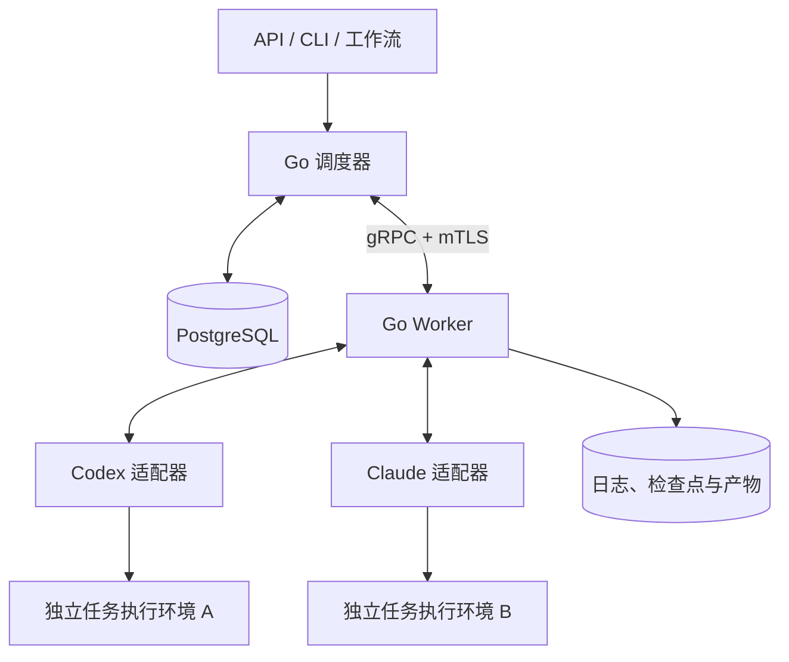
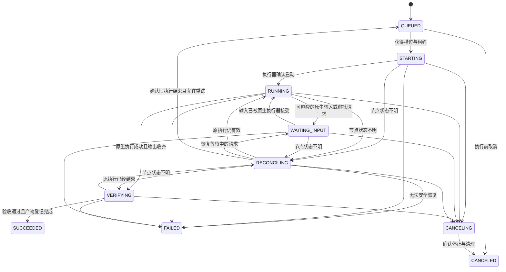
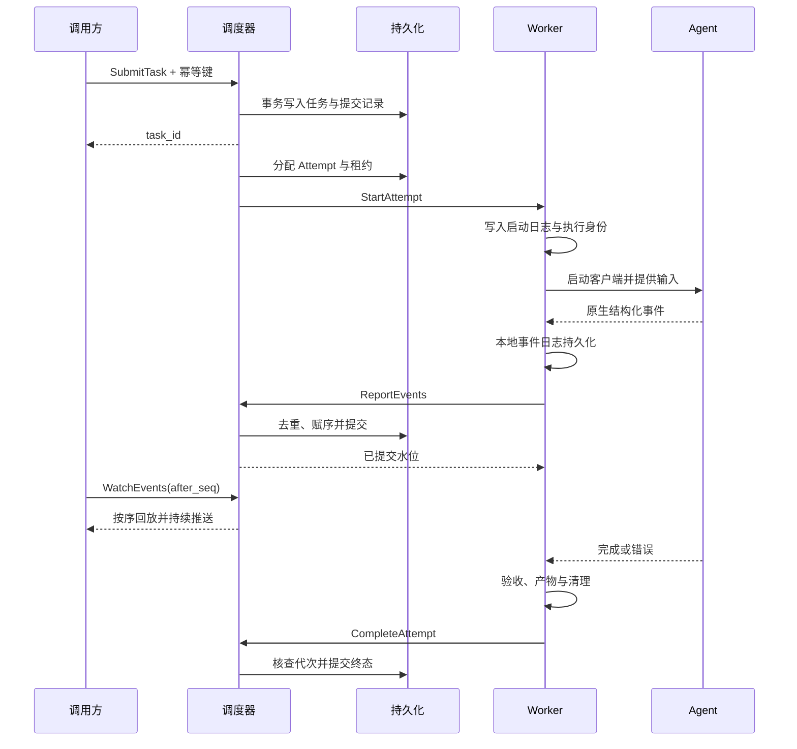

# Go 多客户端 Agent RPC 调度实施方案

- 项目：computecloud
- 日期：2026-09-22
- 状态：实施设计；尚未实现调度服务或进行真实客户端集成验证
- 实现语言：Go
- 配套契约：[Agent Runtime v1](../contracts/agent-runtime-v1.md)

## 1. 目标与结论

在受控执行节点上启动多个 Codex / Claude Code 客户端，通过 RPC 分配任务、提供输入、接收结构化输出、取消执行和收集产物。调度器统一管理任务、账号配额和资源，客户端保留自身的 Agent 循环、上下文管理与工具执行能力。

采用 **Go 调度器 + Go Worker + Go 客户端适配器 + gRPC + PostgreSQL**。首版直接接入已文档化的非交互 CLI，后续按能力增加双向交互模式；Python / TypeScript SDK sidecar 不作为首版依赖。

本文中的组件划分、默认值、API 名称和数据模型都是 computecloud 的设计决定。客户端官方事实单独列出来源，不能把设计接口视为 Codex 或 Claude 的原生接口。

本阶段交付设计和契约。暂不实现 GUI 自动点击、接管任意现有终端、跨引擎内部会话格式转换或自动发布生产变更。

## 2. 官方接口依据与 Go 接入选择

| 客户端能力 | 已核查依据 | 本项目选择 |
| --- | --- | --- |
| Codex 非交互执行 | `codex exec --json` 输出 JSONL；支持按明确会话 ID 恢复。[R1] | 首版 `codex_exec`，Go 直接管理子进程 |
| Codex SDK | 官方建议自动化任务使用 SDK；文档提供 TypeScript 与 Python 接口。[R2] | 作为行为参考；纯 Go 首版采用 CLI 接口，不宣称 CLI 适配器是官方 SDK |
| Codex App Server | 双向 JSON-RPC，支持线程、轮次、审批、中断和追加输入；官方仍将 App Server 命令与 WebSocket 传输标为实验性、不支持生产工作负载。[R3] | 后续 `codex_app_server` 受控试点，默认关闭；本地 stdio 接入不改变其官方支持状态 |
| Claude 非交互执行 | `claude -p` 支持 JSON / stream-json、明确会话恢复及结构化结果。[R4] | 首版 `claude_print`，Go 直接管理子进程 |
| Claude 流式输入 | CLI 支持 `--input-format stream-json`；SDK 的流式模式支持持续输入、排队和中断。[R5][R6] | 后续按固定 CLI 版本验证 `claude_stream`；不能把 SDK 全部控制能力推定为原始 CLI 的稳定协议 |
| Claude 会话持久化 | 会话历史与文件系统是两套状态；跨节点恢复需要同时考虑两者。[R7] | 会话记录与工作区检查点分开保存 |

所有客户端二进制、适配器和运行镜像必须固定版本。Worker 注册时报告实际版本和通过验收的能力集合；调度器不得按“最新版本应当支持”进行推断。

## 3. 分阶段能力边界

| 能力 | P0：批任务闭环 | 后续交互模式 |
| --- | --- | --- |
| 启动任务、输入初始提示词 | 支持 | 支持 |
| 结构化过程事件与最终结果 | 支持；文本细粒度由客户端实际事件决定 | 按引擎能力增强 |
| 任务取消 | 停止本次执行并清理执行容器/进程组 | 优先原生中断，再执行清理 |
| 后续指令与恢复 | 明确 session_ref 创建新 Task；同一会话串行 | 可保持会话热驻留 |
| 执行中追加输入 | 不支持；返回明确能力错误 | `queue_next` / `steer_current` 分别协商 |
| 原生权限请求原地回传 | 不支持；使用事先确定的权限策略，拒绝与阻塞必须可观测 | 仅在原生协议完成验证后开放 |
| 会话跨 Worker 迁移 | 不支持；优先原 Worker 恢复 | 检查点、版本和目录映射均满足时开放 |
| 跨引擎交接 | 任务说明、代码变更、测试结果和工作摘要 | 仍不转换私有会话格式 |

P0 的权限拒绝如果导致任务无法完成，任务进入 FAILED，错误标记为 `PERMISSION_BLOCKED`，保留恢复所需记录。经授权调整策略后创建新的 Task，显式引用前次会话或检查点；不伪装成原进程已暂停并可原地审批。

P0 也不能仅因日志看起来像问题而进入 WAITING_INPUT。只有适配器能识别并响应明确的原生请求，才可以声明等待输入能力。

## 4. 架构



| 组件 | 责任 | 不承担的责任 |
| --- | --- | --- |
| API / Task Service | 身份校验、参数校验、幂等提交、状态查询、事件订阅和控制请求落库 | 不在 RPC handler 生命周期内运行 Agent |
| Scheduler | 队列、优先级、能力匹配、并发与预算、租约、重试决策 | 不解析供应商事件细节 |
| Worker | 工作区准备、进程管理、事件落盘、租约续期、取消和清理 | 不自行扩权或切换账号绕过限制 |
| Adapter | 客户端启动参数、原生事件解析、会话标识、受支持的控制映射 | 不决定全局重试和任务成功 |
| Verifier | 执行可信验收命令，检查产物并产生验收结果 | 不以 Agent 自我声明替代验证 |
| Persistence | 任务状态、控制收件箱、事件、审计和产物引用 | 不保存明文凭据到任务参数或普通日志 |

首版使用一个调度器和固定 Worker 注册配置，先验证多执行槽位。PostgreSQL 同时承担队列和状态存储，暂不引入 Redis / Kafka / 工作流引擎。浏览器接入需要时另加 HTTP + SSE 网关。

## 5. 核心对象

| 对象 | 定义 | 持久化内容 |
| --- | --- | --- |
| Task | 一个具有目标和验收条件的业务任务 | 输入、状态、预算、策略版本、结果 |
| Attempt | Task 的一次实际执行尝试 | Worker、租约代次、退出原因、当前执行状态 |
| Session | 客户端上下文 | 引擎、原生会话 ID、所属身份、原 Worker、状态目录、兼容版本 |
| Turn | 原生会话的一轮工作 | 原生轮次 ID；不支持时字段缺省 |
| Process | 客户端操作系统进程 | PID 与启动身份，仅用于监督，不是业务主键 |
| Workspace | 任务使用的可写文件集合 | 基线 commit、目录/卷、隔离类型、检查点 |
| Artifact | 可交接的执行成果 | 内容摘要、SHA-256、存储位置、来源 Attempt |

初始基线是一个 Attempt 对应一个独立客户端进程和一个写工作区。会话恢复仍须获取 Session 独占租约，避免两个进程同时写同一原生会话历史。

恢复应固定 `session_id`，禁止使用 `--last` 或不带目标的 `--continue`。Session 与身份绑定，不在不同用户或账号之间共享。

Task 进入终态后保持不可变。用户继续工作创建新 Task 并设置 `parent_task_id`；自动故障重试则在原 Task 下创建新的 Attempt。这两个行为必须区分。

## 6. 任务状态机



状态图表达主要路径，以下约束优先：

1. P0 不启用 WAITING_INPUT 路径，除非后续适配器明确声明并验证该能力。
2. `deadline` 是停止原因；超时先进入 CANCELING，确认停止后以 FAILED / `DEADLINE_EXCEEDED` 结束。用户取消则以 CANCELED 结束。
3. CANCELING 未获停止证明时保持非终态并持续核查；不能因 RPC 已返回而报告取消完成。
4. 自动重试只允许在副作用和旧执行状态已经核查后发生。Task 回到 QUEUED 前，先把旧 Attempt 终结并创建下一代 Attempt。
5. 运行中无文本输出不等于卡死。心跳、工具运行、等待权限、API 延迟分别观测。
6. SUCCEEDED 需要原生执行成功、事件完整性检查、可信验收通过和产物登记；取消状态优先阻止成功提交。

## 7. RPC 与执行时序

完整字段和错误语义见[接口契约](../contracts/agent-runtime-v1.md)。核心调用分为三个平面：

| 平面 | 方法 | 用途 |
| --- | --- | --- |
| 调用方 → 调度器 | SubmitTask、GetTask、WatchEvents、SendInput、RespondApproval、CancelTask、ListArtifacts | 用户任务与交互 |
| 调度器 → Worker | StartAttempt、InspectAttempt、ApplyControl、StopAttempt | 分配和监督执行 |
| Worker → 调度器 | RegisterWorker、RenewLease、ReportEvents、CompleteAttempt | 能力注册、租约和可靠事件回传 |

SubmitTask 在任务和幂等记录提交到数据库后返回，不等待 Agent 完成。StartAttempt 在 Worker 持久记录执行身份后返回 STARTING / 已存在状态；不能把返回 ACK 当作进程已启动。



WatchEvents 的连接中断只停止该订阅；任务继续受 Task deadline 和 Worker 租约管理。慢订阅者不能直接阻塞客户端 stdout 的读取。

## 8. Go 模块划分

以下为拟建目录，当前提交只有文档，不创建空实现或伪装已存在的服务。

| 拟建路径 | 职责 |
| --- | --- |
| `cmd/computecloud-server` | API、调度循环和存储初始化 |
| `cmd/computecloud-worker` | Worker 生命周期与运行环境 |
| `cmd/computecloudctl` | 提交、查询、订阅和取消 |
| `api/agent/v1` | Protobuf 定义与生成配置 |
| `internal/task` | 状态机、参数与领域规则 |
| `internal/scheduler` | 能力匹配、槽位、租约和重试 |
| `internal/worker` | Attempt 管理与恢复核查 |
| `internal/adapter/codex` | exec 与后续 app-server 模式 |
| `internal/adapter/claude` | print 与后续 stream 模式 |
| `internal/process` | OS 专属进程组/容器监督和清理 |
| `internal/workspace` | checkout、检查点和产物 |
| `internal/event` | 解析、WAL、去重、序号与回放 |
| `internal/policy` | 策略快照与权限映射 |
| `internal/store/postgres` | 事务、迁移和一致性约束 |
| `internal/verify` | 验收执行与证据记录 |

Go 使用仍在维护的稳定工具链，并在开始编码时固定 `go.mod` / toolchain；客户端版本另行固定。内部 RPC 使用 Protobuf 和 grpc-go；结构化日志使用标准库 slog，生命周期使用 context，子进程使用 os/exec。[R8][R9]

适配器边界如下。这是概念性 Go 接口，`StartSpec` 等领域类型由接口契约定义，尚非可编译实现：

```go
type Adapter interface {
    Probe(ctx context.Context) (Capabilities, error)
    Start(taskCtx context.Context, spec StartSpec, sink EventSink) (Run, error)
}

type Run interface {
    SendInput(ctx context.Context, input Input) (ControlAck, error)
    RespondApproval(ctx context.Context, decision ApprovalDecision) (ControlAck, error)
    Interrupt(ctx context.Context) error
    Stop(ctx context.Context, reason StopReason) error
    Wait(ctx context.Context) (RunResult, error)
}

type EventSink interface {
    Append(ctx context.Context, event NativeEvent) error
}
```

`StartSpec` 携带明确的恢复引用；不另设一个语义不清的“再次启动同一会话”接口。`Wait` 的调用方停止等待不等于 Stop；实际执行生命周期由 Worker 保有的 taskCtx 管理。

不支持的控制方法返回能力错误，不能退化成向 PTY 输入文本。调度器状态改变与原生控制接受分别记录。

## 9. Go 子进程与 I/O 设计

### 9.1 启动路径

1. 校验租约、能力、固定版本、身份、工作区和策略摘要。
2. 为 Attempt 建立持久启动日志，记录 `attempt_id`、代次、执行环境标识与状态。
3. 使用受控路径和参数数组调用 `exec.CommandContext`；提示词通过 stdin 传输，不拼接 shell。[R8]
4. 分开持续读取 stdout 与 stderr：stdout 解析协议，stderr 进入受限诊断日志。
5. 只有收到进程启动与适配器初始化的确认，才报告 RUNNING。
6. 退出后收齐输出、解析原生结果、执行验收并检查残留进程，最后报告 CompleteAttempt。

以下参数数组用于说明 Go 适配器边界，不是包含完整鉴权与权限配置的生产启动命令：

```text
Codex 首次执行：
  codex exec --json --sandbox workspace-write -

Claude 首次执行：
  claude -p --input-format text --output-format stream-json --verbose --include-partial-messages
```

Worker 通过 stdin 写入提示词并在批模式下关闭 stdin。`cwd` 由 Worker 设置为分配的工作区。实际启动还需加入已验证的模型、权限与配置参数；恢复分支按固定版本的 `--help` 和集成验收构造，不机械拼接首次执行参数。

Codex 的 `workspace-write` 不是容器安全边界，网络和进程限制仍由外部执行环境落实。Claude 首版使用明确的允许规则和不等待人工的策略；禁止默认启用绕过全部权限的选项。

### 9.2 输出大小、取消与清理

以下数值均为初始工程配置，需以真实负载调整：

| 项目 | 起始配置 | 语义 |
| --- | --- | --- |
| 原生单事件上限 | 4 MiB | 超限保留受限诊断并报 `PROTOCOL_LIMIT`，不静默截断合法 JSON |
| 内存缓冲 | 16 MiB / Attempt | 有界队列，避免大量日志耗尽 Worker |
| 本地事件日志上限 | 256 MiB / Attempt | 达上限时停止接收新工作；当前任务受控停止并报告存储压力 |
| 普通控制 RPC deadline | 10 s | 只约束本次 RPC，不代表任务运行时长 |
| 默认 Task deadline | 30 min | 调用方可在策略允许范围内覆盖 |
| 优雅停止时间 | 10 s | 之后升级强制停止并确认残留进程清理 |

事件读取器采用有明确大小边界的分帧逻辑；如果使用 bufio.Scanner，必须显式设置上限并处理错误。终态事件不能与大量文本增量一起被丢弃。

`CommandContext` 默认取消不会替项目完成整个进程树监督。Linux Worker 优先使用每 Attempt 容器或专属 cgroup；直接进程模式使用进程组并记录启动身份，不能仅凭可复用 PID 杀进程。支持其他 OS 时单独实现相应监督机制。

如果使用 StdoutPipe / StderrPipe，必须安排持续读取并遵守 Wait 的关闭时序；如果用自定义 Writer，写入要有界且及时返回。对子孙进程持有管道导致的退出等待设置独立期限。`WaitDelay` 只用于限定部分等待，不作为完成进程树清理的证明。[R8]

Worker 崩溃恢复时检查容器/cgroup、启动日志与进程身份；“数据库没有 RUNNING”不等于没有启动过客户端。遇到无法判断的启动窗口进入 RECONCILING，不重新启动第二份进程。

## 10. 事件持久化与重连

事件包含 `task_id`、`attempt_id`、`generation`、`event_id`、`worker_seq`、类型与内容。Worker 为每 Attempt 顺序写本地事件日志；控制平面去重后分配 Task 范围内的 `seq`。[契约](../contracts/agent-runtime-v1.md#5-事件契约)

保证方式：

1. Worker 对已持久化但未确认的事件至少一次重发；控制平面按唯一键去重。
2. 同一 Attempt 按 worker_seq 连续确认水位，乱序段补齐后才能推进水位。
3. 控制平面将事件、状态变更与 Task 的序号分配放在同一事务中；序号按提交可见顺序增加。
4. WatchEvents 以数据库为回放依据，从 `seq > after_seq` 开始；通知机制仅用于唤醒，不能作为唯一事件来源。
5. 从历史读取切换到实时订阅时再次查表，避免“刚读完历史、尚未开始订阅”的漏事件窗口。
6. 关键事件立即或短批次持久化；文本增量可在形成规范事件前合并。进程意外退出前尚未落盘的字节无法保证恢复，必须记录缺口，不能声称全文无损。
7. 若事件保留期已过，返回明确的游标过期错误与可用最小 seq，不伪造连续回放。

CompleteAttempt 携带 `final_worker_seq`。控制平面必须确认该水位之前的事件和产物登记完成，才接受终态。对过期代次的回报只保存审计信息，不能覆盖当前 Task。

## 11. 存储模型与一致性

| 表/实体 | 关键字段与约束 |
| --- | --- |
| `tasks` | task_id、owner_id、project_id、state、active_attempt_id、version、next_seq、spec、deadline |
| `task_submissions` | owner_id + project_id + idempotency_key 唯一；保存规范化 request_hash 与 task_id |
| `attempts` | attempt_id、task_id、generation、worker_id、lease_token_hash、lease_expires_at、state；同 Task 的 generation 唯一 |
| `sessions` | engine、native_session_id、owner_id、credential_ref、worker_id、state_ref、workspace_ref、runtime_version |
| `session_leases` | session_ref 唯一的活动写租约，含持有 Attempt 与到期时间 |
| `events` | task_id + seq 唯一；attempt_id + event_id 唯一；attempt_id + worker_seq 唯一 |
| `controls` | task_id + control_id 唯一；request_hash、目标 Attempt/Turn、状态、响应 |
| `artifacts` | artifact_id、task_id、attempt_id、内容哈希、字节数、URI、类型 |
| `workers` | worker_id、identity、engine_versions、capabilities、slots、health |
| `audit_records` | 策略版本、授权决策、状态核查、控制动作与终态证据 |

数据库事务只用于短操作，不能在事务内等待 LLM、RPC 或构建命令。分配队列时可以使用 `FOR UPDATE SKIP LOCKED` 获取可用任务并在同一短事务中创建 Attempt 和租约；这一机制适合队列竞争，不代替执行幂等。[R10]

推荐用数据库中的额度/槽位记录参与同一分配事务。多调度器阶段再增加领导者选举或一致的分配协调；不能仅靠各进程内 semaphore 控制集群配额。

同幂等键但 request_hash 不同必须报错。Worker 的 StartAttempt 也须按 attempt_id + generation 去重，不能只依赖 API 提交去重。副作用操作不能因 gRPC 重试成功而被视为恰好一次执行。[R9]

## 12. 调度、租约与故障恢复

### 12.1 选择 Worker

先过滤身份、权限、运行时版本、capabilities、OS、工作区可达性和恢复位置，再按可用槽位、账号配额、排队时间选择 Worker。引擎、模型、账号和执行载体是独立维度。

并发限制同时考虑 Worker CPU/内存/磁盘、项目、账号、模型和预算。多开 CLI 不增加账号额度；构建与测试消耗的资源也应计入。没有实测前不承诺固定机器可支撑多少并发。

### 12.2 租约

起始配置：租约 60 s、每 15 s 续期，均可调。Worker 根据最近一次成功续期的 TTL 使用本地单调计时，在到期前停止接受新控制并发起停机；执行环境应有独立监督，降低 Worker 卡死时孤儿进程继续运行的风险。

租约代次只能拒绝旧执行结果，不能撤销旧进程已经发出的命令或外部 API 请求。租约过期后 Task 进入 RECONCILING；调度器确认旧环境停止并核查副作用后才允许重新分配。

### 12.3 错误处理

| 故障 | 处理 |
| --- | --- |
| CLI 未找到、版本不兼容、配置错误 | 标记 Worker 对应能力不可用，任务快速失败或重新选择合适节点 |
| 账号未登录、密钥失效、额度不足 | 暂停该凭据对应队列并返回明确原因，不无条件换账号 |
| 网络瞬断 | 优先让客户端自身完成其重试；平台不同时启动另一个 Attempt |
| Worker 无响应 | RECONCILING，核查旧环境和持久事件后决定恢复 |
| 只读分析任务失败 | 在确认旧执行停止、预算允许后进行有界重试 |
| 文件修改任务失败 | 保存 diff 与检查点，确认基线与工作区状态后恢复或重新执行 |
| 已发生 push、发布或外部写操作 | 按业务幂等键和外部结果核对，不能仅凭失败码自动重跑 |
| 事件落盘失败、磁盘满 | 停止新任务并受控停止受影响执行，报告存储错误 |

首版建议关闭自动跨节点恢复；错误分类和核查流程完成后，再按任务类型逐项启用自动重试。

## 13. 工作区、验收与产物

一个并行写 Attempt 使用一个独立 checkout 或 worktree。worktree 是版本控制隔离，不是安全边界；不可信任务使用独立容器/用户、受限挂载和网络策略，避免通过共享 `.git`、凭据目录或宿主挂载影响其他任务。

工作区必须记录基线 commit。恢复时同时校验原生会话、文件检查点、工具链和身份，缺任何一项都不能宣称“原样恢复”。同一引擎也不能仅复制一个 session ID 就迁移成功。

验收命令由平台受信模板提供，Agent 可以运行测试，但最终验收由独立步骤执行。验收产生以下产物：

- 最终工作摘要、原生执行状态与错误分类。
- 可审阅的代码变更，包括 tracked / untracked 文件清单；检查遗漏的新文件、删除和二进制变更。
- 测试与构建报告，包含命令、退出码、基线和运行环境。
- 用量与费用元数据，缺失时标记 unknown；不同计费口径不能直接相加。
- 可选的会话和工作区检查点，按任务权限访问。

跨引擎工作流以这些产物交接。例如 Codex 实现后，Claude 基于同一冻结变更进行评审；修复与合并由新的 Task 执行。评审任务默认只读，不能和实现任务同时修改同一目录。

## 14. 权限、凭据与运行配置

平台 API 校验用户对 project_id、workspace_ref、credential_ref 的使用权限。Worker 使用独立机器身份和 mTLS，不能凭提交参数指定任意可执行路径、任意宿主目录或额外 shell 参数。

策略采用不可变版本和摘要，映射到客户端原生权限机制与操作系统执行边界。不能仅依靠提示词限制目录或网络。未识别的原生审批类型必须失败关闭或进入经过支持的等待状态。

密钥不写入 Task、事件和示例配置。凭据只在执行节点按身份注入，并限制构建/测试子进程读取；日志脱敏不是凭据隔离。不同租户不得共享可写的 CLI 配置和认证目录。

Claude SDK 文档限制未经批准的第三方产品使用 claude.ai 登录和额度。[R11] 本设计使用 CLI 并不构成绕过认证限制的依据；个人自用、内部服务和对外产品应分别核对支持的鉴权方式。

示例配置仅定义 computecloud 的设计字段，并非 Codex / Claude 的原生配置：

```yaml
worker:
  id: worker-linux-01
  slots: 2
  workspace_root: /var/lib/computecloud/workspaces
  event_log_root: /var/lib/computecloud/events
  isolation: container
  lease_ttl: 60s
  renew_interval: 15s
  graceful_stop_timeout: 10s
  runtimes:
    codex_exec:
      enabled: true
      executable: /opt/agent-runtime/bin/codex
      version_policy: pinned
    claude_print:
      enabled: true
      executable: /opt/agent-runtime/bin/claude
      version_policy: pinned
    codex_app_server:
      enabled: false
    claude_stream:
      enabled: false
  credentials:
    source: worker_secret_store
  transport:
    require_mtls: true
```

配置中的路径是执行镜像内约定路径，不是本次对话环境或任何生产节点的真实地址。编码阶段必须补齐证书加载、运行镜像摘要、允许策略和凭据引用的具体实现。

## 15. 持续交互扩展

Codex App Server 适配器在独立 profile 下完成 initialize、thread/start 或 thread/resume、turn/start，以及事件读取；支持时映射 turn/steer、turn/interrupt 和服务器发起的审批请求。[R3] 请求响应关联表必须与通知流分离，服务器请求也必须正常响应，不能把所有输入都当成客户端请求结果。

原生追加输入成功只表示指令被接受，不保证撤销已执行命令。`steer_current` 必须带目标轮次校验，过期轮次请求不能落入下一轮。

Claude stream 模式先验证公开的 JSON 输入帧、输出帧和正常关闭行为。SDK 的 interrupt / approval 回调不等于原始 CLI 有同名稳定 JSON 方法，未经文档与固定版本测试确认，不实现猜测性的控制帧。

若未来纯 Go 路线无法满足某项完整交互能力，应把它记录为能力缺口。单独的架构决策可以评估 SDK bridge；在决策前不把 Python / TypeScript sidecar 隐式加入 Go 首版依赖。

## 16. 里程碑与验收

| 阶段 | 实施内容 | 进入下一阶段的条件 |
| --- | --- | --- |
| P0-A：基础模型 | Protobuf、Task/Attempt、PostgreSQL 迁移、提交与查询、Fake Adapter | 幂等冲突、状态转换、取消竞态能够通过真实行为测试 |
| P0-B：真实执行 | Go Worker、codex_exec、claude_print、I/O 与进程清理 | 两类客户端各完成成功、失败、超时、取消与明确会话恢复 |
| P0-C：可靠闭环 | 事件日志、重连补读、工作区、产物、验收 | 断线不丢已确认事件，进程不遗留，并发代码互不覆盖 |
| P1：多节点恢复 | Worker 注册、槽位/账号配额、租约、核查与有界重试 | 重复投递和节点故障不会同时运行重复写任务 |
| P2：双向交互 | capability 协商、持续会话、输入和审批路由 | 各能力在固定版本下通过取消、重复输入和过期请求验收 |
| P3：工作流 | DAG、跨引擎评审、配额优化与可观测性 | 依赖和交接产物可审计，失败可定位到具体 Attempt |

关键验收场景：

1. SubmitTask 响应丢失后同键重试，只产生一个 Task；同键异参被拒绝。
2. StartAttempt 响应丢失后重复调用，只启动一次进程；启动状态不明时进入核查。
3. 大量 stdout / stderr 和单条超大 JSON 不引发死锁、无限内存或静默漏终态。
4. WatchEvents 慢消费者、断线和重连不影响执行；after_seq 补读保持有序。
5. 租约过期、Worker 崩溃、旧 Worker 恢复时，旧代次不能覆盖新状态，也不能未经核查重复执行。
6. 取消与完成并发时只产生一个合法终态；取消后确认子进程/容器已停止。
7. 两个并发写任务保持独立工作区；同一 Session 不出现并发写入。
8. 权限拒绝、限额、鉴权失效和等待输入能区分，不能统一显示“运行超时”。
9. 缺少 final 事件、日志截断或验收失败，即使进程退出码为 0 也不能标为成功。
10. 客户端升级回放旧事件样本并运行真实烟测；未知事件不得破坏已知终态处理。

本次文档提交不执行上述真实客户端测试，也不创建或运行生产 Agent。开始编码时使用 Fake Adapter 完成状态与故障测试，再用受限测试仓库和预算进行真实集成。

## 17. 待编码时固定的参数

下列项目不影响当前设计，但必须在对应能力上线前落实：Go / grpc-go / Protobuf 的精确版本、Codex / Claude CLI 版本及校验值、支持的认证方式、Worker OS、容器运行方式、凭据隔离方式、数据库与产物存储位置、事件保留周期、配额、任务 deadline 和允许执行策略。

现阶段按 Linux Worker、容器隔离、单调度器、PostgreSQL、每节点 2 个槽位作为保守起始配置；这些是配置建议，不是已测容量或既有项目事实。

## 18. 官方参考资料

接口核查日期：2026-09-22。以下来源支持客户端与底层库的事实；系统架构、状态机、数据模型与默认配置为本项目设计。

- [R1 — Codex 非交互模式](https://learn.chatgpt.com/docs/non-interactive-mode)
- [R2 — Codex SDK](https://learn.chatgpt.com/docs/codex-sdk)
- [R3 — Codex App Server](https://learn.chatgpt.com/docs/app-server)
- [R4 — Run Claude Code programmatically](https://code.claude.com/docs/en/headless)
- [R5 — Claude Code CLI reference](https://code.claude.com/docs/en/cli-reference)
- [R6 — Claude Agent SDK Streaming Input](https://code.claude.com/docs/en/agent-sdk/streaming-vs-single-mode)
- [R7 — Claude Agent SDK sessions](https://code.claude.com/docs/en/agent-sdk/sessions)
- [R8 — Go os/exec](https://pkg.go.dev/os/exec)
- [R9 — gRPC retry](https://grpc.io/docs/guides/retry/)
- [R10 — PostgreSQL SELECT / locking](https://www.postgresql.org/docs/current/sql-select.html)
- [R11 — Claude Agent SDK overview](https://code.claude.com/docs/en/agent-sdk/overview)
