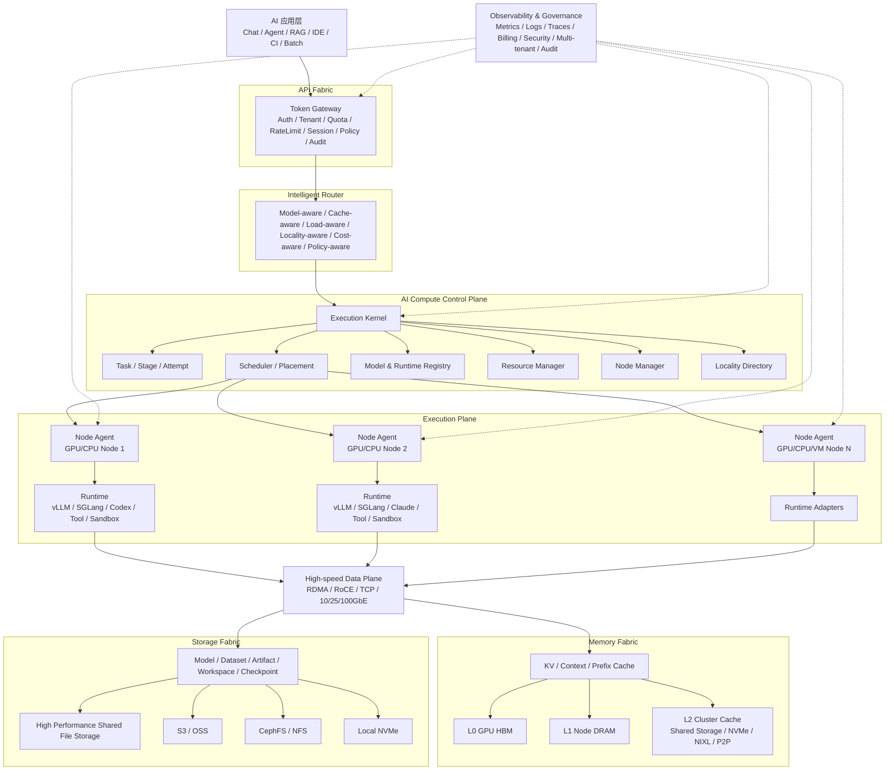

# AI Execution OS 总体架构

> **状态：上层目标架构 / 独立产品边界。** AI Execution OS 不再被视为 computecloud v0.2 的线性演进；computecloud 继续保持 Agent Job Executor 产品边界，并作为 AI Execution OS 的 Execution Kernel / Agent Job Executor 子系统被复用。参见 [ADR-003](../adr/0003-agent-job-executor-product-scope.md)。

- 项目：computecloud（承载 Execution Kernel 子系统）
- 日期：2026-09-24
- 状态：AI Execution OS 上层架构；不是当前 v0.2 已实现事实
- 当前实现基线：[v0.2 网关与 Map/Reduce 设计](gateway-mapreduce-v0.2.md)
- 现有 Runtime 基线：[Go 多客户端 Agent RPC 调度实施方案](agent-orchestration-go.md)

## 1. 定位

AI Execution OS 的核心不是“管理所有 AI 基础设施”，而是：

> **把 Goal 编译为可执行的 Execution Graph，动态组织 Model、Agent、Tool、Knowledge 与 Compute，并将结果验证为 Verified Outcome；再利用执行反馈持续优化后续 Execution。**

稳定主链路：

~~~text
Goal
  ↓
Plan / Execution Graph
  ↓
Intelligence Selection
  ↓
Execution Kernel
  ↓
Model / Agent / Tool / Knowledge / Compute
  ↓
Verifier
  ↓
Verified Outcome
  ↓
Experience / Feedback
  └──────────────↺
~~~

与 computecloud 的边界必须保持清晰：

- **AI Execution OS**：上层目标系统，负责 Goal → Verified Outcome；
- **computecloud**：Agent Job Executor，负责可靠、可恢复、可治理的远程 Agent Job 执行；
- computecloud 不因被 AI Execution OS 复用而扩展成 Model Serving、Training Scheduler、GPU Cloud 或通用 Workflow Engine；
- Model Gateway、Training Platform、Knowledge Platform、Compute Platform 可以是独立系统，通过稳定接口接入。

一句话：

> **Models generate intelligence. Agents perform actions. AI Execution OS turns goals into verified outcomes.**

## 2. 总体架构



主执行链路：

```text
Client / Agent
    -> Token Gateway
    -> Intelligent Router
    -> AI Compute Control Plane
    -> Scheduler / Placement
    -> Node Agent
    -> Runtime
    -> Memory / Storage / Tool
    -> Result
```

## 3. 核心抽象

平台优先固定抽象，不把 vLLM、LMCache、具体共享存储实现、Kubernetes 等具体实现泄漏到上层协议。

### 3.1 Execution

所有工作负载统一进入 Execution：

```text
Execution
├── Stage
│   ├── Task
│   │   └── Attempt
│   └── Task
└── Dependency
```

- **Execution**：一次完整的业务执行；
- **Stage**：执行阶段或屏障；
- **Task**：逻辑任务；
- **Attempt**：Task 的一次真实运行；
- **Dependency**：任务间依赖。

保持现有原则：**Task != Attempt**。Task 是逻辑实体，失败重试创建新的 Attempt，不能把网络重传误当成新的业务执行。

### 3.2 ResourceClaim

Task 不指定具体节点，而声明所需能力：

```yaml
resource_claim:
  accelerator:
    type: gpu
    memory: 48GiB
  runtime:
    any_of: [vllm, sglang]
  model:
    name: qwen
  storage:
    high_performance: true
```

由 Scheduler 决定实际 Placement。

### 3.3 Placement

Placement 是控制面的最终调度决定：

```text
ResourceClaim
    + Runtime Capability
    + Model Locality
    + KV Locality
    + Dataset Locality
    + Queue/Load
    + Network/Cost
    -> Placement
```

### 3.4 Artifact 与 Location

Execution 的结果、Workspace、模型、数据和缓存都使用稳定引用，不让上层依赖物理路径。

建议 URI：

```text
model://qwen/version-1
dataset://project/train-v3
artifact://execution/E001/output
workspace://execution/E001
checkpoint://training/T88/step-10000
cache://kv/<namespace>/<prefix-hash>
```

底层由 Resolver 映射到 Shared File Storage、Object Storage、CephFS/NFS、Local NVMe 等 Provider。

## 4. API Fabric：Token Gateway

Token Gateway 保持轻量，负责：

- Identity / Token；
- Tenant；
- Quota / Rate Limit；
- OpenAI / MCP / 内部协议归一；
- Session；
- Policy；
- Audit；
- Billing attribution。

Gateway 不直接管理 GPU、具体存储后端、KV 目录或 Worker 选择。

外部请求进入后转为内部稳定的 Execution Request，再交给 Router / Control Plane。

原则：

```text
Gateway = access + governance
Scheduler = placement
Runtime = execution
Storage/Memory = data movement
```

避免 Token Gateway 演变为同时承担鉴权、GPU 调度、Agent 调度、KV 管理和 Workflow 的巨型服务。

## 5. Intelligent Router

Router 输出 **Placement Preference**，不直接做最终绑定。

主要考虑：

- model-aware；
- cache-aware；
- load-aware；
- locality-aware；
- cost-aware；
- policy-aware。

Router 与 Scheduler 的边界：

```text
Router:
    “从 AI 语义和局部性看，哪些节点/资源更优”

Scheduler:
    “在当前资源、租约、配额和并发约束下，最终绑定到哪里”
```

例如 Node A 的 GPU 利用率高于 Node B，但 A 已具备模型和 90% KV 命中时，Router 可提高 A 的偏好；Scheduler 仍可因队列、资源不足或策略限制选择 B。

## 6. Execution Kernel

Execution Kernel 是 AI Compute 的核心，而不是 GPU Scheduler 本身。

职责：

- Execution / Stage / Task / Attempt 生命周期；
- dependency / barrier；
- retry / cancel / timeout / reconcile；
- ResourceClaim；
- Placement；
- lease / heartbeat；
- result / Artifact 提交；
- Map-Reduce / Workflow 的执行语义。

与现有 v0.2 的关系：

- v0.2 的 Job / Task / Attempt 是可运行基线；
- 本设计将其向通用 Execution / Stage 扩展；
- 不要求首版马上实现任意 DAG；
- 明确的 Map -> Reduce 仍可作为首个 Stage 模型。

## 7. Compute Fabric

Compute Fabric 抽象的是计算资源，不等于 GPU：

```text
Compute Resource
├── CPU
├── GPU / NPU / Accelerator
├── Memory
├── Local NVMe
├── Network
└── Runtime Capability
```

底层可以是：

- Bare Metal；
- Kubernetes；
- KubeVirt / VM；
- 公有云 VM / GPU；
- 第三方 GPU Cloud。

Control Plane 统一看到 Node / Resource / Capability，不直接依赖具体载体。

## 8. Node Agent 与 Runtime Fabric

每个计算节点运行 Node Agent，负责：

- register；
- heartbeat；
- resource report；
- capability report；
- task launch / stop；
- lease；
- log / metrics；
- artifact；
- local cache / storage 状态。

Runtime 必须通过适配层解耦：

```text
runtime/
├── vllm/
├── sglang/
├── codex/
├── claude/
├── shell/
├── container/
└── vm/
```

建议长期接口：

```go
type Runtime interface {
    Prepare(ctx context.Context, req PrepareRequest) error
    Start(ctx context.Context, task Task) (ExecutionHandle, error)
    Stop(ctx context.Context, id string) error
    Status(ctx context.Context, id string) (*RuntimeStatus, error)
    Capabilities() CapabilitySet
}
```

Scheduler 不使用大量 `if runtime == ...` 绑定实现，只按 Capability 匹配。

## 9. Memory Fabric：AI Memory Hierarchy

Memory Fabric 面向 **可重新计算、性能敏感的缓存语义**。

建议分层：

```text
L0  GPU HBM
    ↓
L1  Node DRAM
    ↓
L2  Node NVMe / Cluster Cache
    ↓
L3  Shared Storage Backend
```

内容包括：

- KV Cache；
- Prefix Cache；
- Context；
- Agent State Cache；
- Embedding Cache；
- Tool / RAG Cache。

核心操作：

```text
Locate
Load
Store
Evict
Promote
Demote
Replicate
```

LMCache、NIXL、GPU P2P、共享存储等都属于 Provider / Backend，而不是控制面协议本身。

### 9.1 KV Cache Namespace

共享 KV 不应仅使用 prompt hash，至少纳入：

- model_id / revision；
- tokenizer revision；
- runtime / runtime version；
- KV format / dtype；
- TP / PP；
- attention / RoPE 相关兼容参数；
- chunk format / cache schema version；
- prefix hash。

旧模型或不兼容 Runtime 的 KV 必须隔离，避免错误复用。

### 9.2 Cache 是性能依赖，不是可用性依赖

推荐 fail-open：

```text
cache hit      -> load/reuse
cache timeout  -> recompute
cache corrupt  -> discard + recompute
cache backend unavailable -> bypass
```

Memory Fabric 不应让远端共享存储或 Cache 后端故障直接导致推理服务不可用。

## 10. Storage Fabric：高级文件存储抽象

Storage Fabric 面向 **持久化数据语义**：

- Model Store；
- Dataset Store；
- Artifact Store；
- Workspace Store；
- Checkpoint Store。

上层使用资源 URI，而不是硬编码具体存储挂载路径。

Storage Provider 可包括：

```text
High Performance Shared File Storage
CephFS / NFS
S3 / OSS
Local NVMe
```

### 10.1 高性能共享文件存储的平台定位

高性能共享文件存储定位为：

> **Storage Fabric 的高性能共享文件存储 Provider，同时可作为 Memory Fabric 的容量型 / 持久化 Backend。**

即：

```text
                    AI Data Infrastructure
                             |
               +-------------+-------------+
               |                           |
        Memory Fabric                Storage Fabric
        cache semantics              storage semantics
               |                           |
               +-------------+-------------+
                             |
                  Shared File Storage
```

两层可以共享同一底层高性能文件存储，但语义保持分离：

| 维度 | Memory Fabric | Storage Fabric |
| --- | --- | --- |
| 目标 | 性能复用 | 可靠持久化 |
| 典型内容 | KV / Context / Prefix | Model / Dataset / Artifact |
| 生命周期 | 短或可淘汰 | 长期 |
| 丢失 | 可重新计算 | 可能导致执行无法恢复 |
| 一致性 | Cache semantics | Storage semantics |
| 故障策略 | fail-open | 明确错误 / 恢复 |

### 10.2 模型文件分层

模型可形成：

```text
GPU/HBM
   ↑
Local NVMe
   ↑
Shared File Storage
   ↑
Object Storage
```

共享文件存储作为集群级共享 Source of Truth / 高速源，Local NVMe 作为节点级模型缓存，以降低重复拉取和冷启动。

## 11. Locality Engine

Locality Engine 建议成为独立控制面模块，维护：

- Model Location；
- KV Location；
- Dataset Location；
- Workspace Location；
- Artifact Location；
- Runtime Location。

示例：

```text
Qwen Model
├── Node01 NVMe
├── Node02 NVMe
└── Shared File Storage

Prefix ABC
├── Node02 GPU
├── Node01 DRAM
└── Shared File Storage

Dataset X
└── Shared File Storage
```

Scheduler 通过 Locality Directory 查询数据位置，而不是自己解析各 Provider。

## 12. Scheduler

Scheduler 建议采用四阶段：

```text
Filter -> Score -> Select -> Bind
```

### 12.1 Filter

硬约束：

- Runtime 是否支持；
- Model / capability 是否满足；
- GPU / Memory 是否足够；
- Tenant / Policy 是否允许；
- Node / lease 是否健康。

### 12.2 Score

软约束：

- resource availability；
- model locality；
- KV locality；
- dataset locality；
- workspace locality；
- queue depth；
- network cost；
- monetary cost。

示意：

```text
PlacementScore =
    ResourceScore
  + ModelLocality
  + KVLocality
  + DatasetLocality
  + WorkspaceLocality
  - QueueCost
  - NetworkCost
  - MonetaryCost
```

具体权重必须来自压测与业务 SLA，不在架构文档中固定为“最佳值”。

不同 workload profile 使用不同策略：

- inference：KV / Model locality 权重更高；
- agent：Workspace / Tool capability 更重要；
- training：GPU topology / network / dataset locality 更重要。

## 13. Tool Fabric

Tool 不应作为 Agent Runtime 内部不可见细节，长期可抽象为：

```text
Tool Fabric
├── Shell
├── Browser
├── Git
├── MCP
├── API
├── Database
└── Custom Tool
```

Node Agent 报告 ToolCapability，Scheduler 可以把工具能力纳入 Filter / Placement。

这允许 Agent Task、Model Call、Shell、Browser、MCP 统一进入 Execution DAG，而不是形成旁路系统。

## 14. Observability & Governance

建议统一 Request / Execution / Task / Attempt ID，贯穿：

```text
Gateway
-> Router
-> Scheduler
-> Node Agent
-> Runtime
-> Memory Fabric
-> Storage Fabric
```

至少观测：

- end-to-end latency；
- queue latency；
- routing / scheduling latency；
- runtime latency；
- TTFT / TPOT；
- GPU utilization；
- model load latency；
- KV L0/L1/L2 hit ratio；
- token cache hit ratio；
- cache load/write latency；
- shared storage read/write throughput / metadata latency；
- network/RDMA utilization；
- task retry / reconcile / failure；
- tenant usage / billing attribution。

KV 场景应优先使用 **Token Cache Hit Ratio**，不能只看 request hit ratio。

## 15. 目标模块结构

目标代码边界可逐步演进为：

```text
computecloud/
├── cmd/
│   ├── gateway/
│   ├── controller/
│   └── node-agent/
├── internal/
│   ├── gateway/
│   ├── execution/
│   ├── scheduler/
│   ├── router/
│   ├── registry/
│   ├── runtime/
│   ├── compute/
│   ├── locality/
│   ├── memory/
│   ├── storage/
│   ├── tool/
│   └── node/
├── pkg/
│   ├── api/
│   ├── protocol/
│   └── client/
└── docs/
```

这不是立即重构要求。当前单二进制可继续保留，上述目录首先用于模块职责边界，未来再根据实际规模决定是否拆服务。

## 16. MVP 演进建议

### Phase 0：保持 v0.2 可运行基线

继续保留：

- 单 Go Server；
- SQLite；
- Token HTTP/MCP；
- Job / Task / Attempt；
- 多 Worker；
- Codex / Claude CLI Runtime；
- 明确 Map -> Reduce。

### Phase 1：Execution Kernel 抽象

优先固定：

- Execution；
- Task；
- Attempt；
- ResourceClaim；
- Placement；
- Artifact。

避免先扩展大量 Provider。

### Phase 2：Runtime / Node Capability

增加：

- Runtime Adapter；
- Node Capability；
- Resource Registry；
- Model Registry 的最小版本；
- vLLM / SGLang 其中至少一个推理 Runtime。

### Phase 3：Storage Fabric

增加：

- storage URI / resolver；
- Local Provider；
- Shared File Storage Provider；
- Model / Artifact / Workspace Store；
- Local NVMe model cache。

### Phase 4：Memory Fabric + Locality

增加：

- KV Directory；
- LMCache 或兼容 KV Provider；
- DRAM / Shared Storage tier；
- Token Cache Hit 指标；
- Locality Directory；
- cache/model-aware routing。

### Phase 5：高级调度

在真实压测数据基础上加入：

- workload profiles；
- locality-aware score；
- cost-aware routing；
- hierarchical / multi-cluster scheduling；
- 必要时再评估外部状态库、消息系统或 HA 控制面。

## 17. 第一批稳定协议对象

优先稳定以下对象：

```text
Execution
Task
Attempt
ResourceClaim
Placement
Node
Resource
RuntimeCapability
Artifact
Location
CacheLocation
```

技术实现映射：

```text
vLLM / SGLang -> Runtime Provider
Codex / Claude -> Agent Runtime Provider
Shared File Storage -> Storage Provider / Memory Backend
LMCache -> Memory Provider
Kubernetes / VM / Bare Metal -> Compute Provider
```

这样未来替换底层实现时，不需要修改 Execution 协议。

## 18. 产品边界总结

computecloud 的目标不是：

- 一个 vLLM 管理器；
- 一个 GPU 资源池；
- 一个 Codex/Claude RPC 服务；
- 一个 Token Gateway；
- 一个 UPFS 管理平台。

这些都只是平台组件。

目标产品边界是：

> **computecloud = AI Execution Infrastructure / AI Execution OS：统一管理 AI 请求、模型、Agent、Runtime、Compute、Memory、Storage、Tool 和 Workflow 的执行基础设施。**

可以类比：

```text
Linux Process         -> Execution
Linux Thread          -> Task
CPU Scheduler         -> AI Scheduler
Memory/Page Cache     -> Memory Fabric
Filesystem            -> Storage Fabric
Device Driver         -> Runtime / Provider Adapter
Daemon                 -> Node Agent
Syscall/API            -> Execution API
```

该抽象为后续多模型、多 Agent、多节点、KubeVirt/裸金属、KV Cache、共享存储、高速网络以及 Token Gateway 提供统一演进边界。


---

## 19. 2026-09-24 架构补齐：Execution-centric AI OS

本节覆盖本文早期“大一统 AI 基础设施”的表达。长期设计以 **Execution 为主轴**，而不是把 Model Serving、Storage、Training、GPU Cloud 全部并入同一产品。

### 19.1 八个逻辑层

~~~text
1 Experience / API
  User / App / IDE / API / MCP / A2A / Voice / Multimodal
                         ↓
2 Goal & Planning
  Intent → Goal → Planner → Task Graph → Execution Graph
                         ↓
3 Intelligence Control Plane
  Registry → Evaluation → Policy → Intelligent Router
                         ↓
4 Execution Kernel
  Agent Job Executor
  Scheduler / Runtime / State / Retry / Checkpoint / Sandbox / Workspace
                         ↓
5 Context / Knowledge / State
  Context Manager / Memory / RAG / Knowledge / Artifact / Cache / Session State
                         ↓
6 AI Runtime & Tool Runtime
  Token/Model Gateway / Cloud API / vLLM / SGLang
  MCP / A2A / Browser / Computer / Shell / Git / API
                         ↓
7 Compute Fabric
  K8s / KubeVirt / VM / Container / Bare Metal
  GPU / NPU / PPU / CPU / Edge
                         ↓
8 Verification & Observability
  Trace → Trajectory → Result → Verifier → Verified Outcome
                         ↓
  Experience / Feedback / Learning Loop
                         └────────────────────────────↺
~~~

这些是逻辑层，不要求实现成八个服务。

### 19.2 Execution Kernel 与 computecloud

Agent Job Executor 是 AI Execution OS 的核心执行子系统，但不是整个 AI Execution OS。

传统 OS 与 AI Execution OS 的近似映射：

| Operating System | AI Execution OS |
| --- | --- |
| Process | Agent / Job |
| Thread | Task / Sub-Agent |
| Scheduler | Agent-aware Scheduler |
| CPU | Model / Agent Runtime / Compute |
| syscall | Tool / MCP / API |
| Process memory | Context |
| Page cache | Prompt / Prefix / Context Cache |
| File system | Artifact / Workspace / Knowledge |
| Device driver | Runtime / Provider Adapter |
| IPC | A2A / Event / Message |
| process state | Execution / Attempt State |
| perf / tracing | Evaluation / Observability |

computecloud 当前的 Job → Stage → Task → Attempt 模型继续保持，不改成 AI Execution OS 的全部领域模型。

### 19.3 四个一级对象

AI Execution OS 上层领域建议收敛为：

~~~text
Goal
  ↓
Execution
  ↓
Resource
  ↓
Outcome
~~~

- **Goal**：调用方希望得到的业务结果；
- **Execution**：为实现 Goal 生成、可恢复和可重放的执行图；
- **Resource**：Model / Agent / Tool / Skill / Knowledge / Compute；
- **Outcome**：经过 Verifier 确认的结果。

computecloud 的 Job / Stage / Task / Attempt 是 Execution 的一种可靠执行实现，而不是 Goal / Resource / Outcome 的替代。

### 19.4 Context Manager / Context Compiler

Context 必须成为一级运行时能力。输入可以包括：

~~~text
User Context
+ Task Context
+ Conversation
+ Memory
+ Repository
+ Knowledge
+ Artifact
+ Tool Result
+ Previous Trajectory
        ↓
Context Compiler
        ↓
Selected Model / Agent
~~~

职责包括：

- context selection；
- compression / summarization；
- cache reuse；
- permission filtering；
- model-specific context compilation；
- token / cost budget；
- stale context invalidation；
- provenance。

Context Plane 可以独立实现，不应把 computecloud 变成 Knowledge/RAG 产品。

### 19.5 Execution State Machine

长任务必须被视为有状态进程。上层建议状态：

~~~text
Created
  ↓
Planned
  ↓
Queued
  ↓
Running
  ├─ WaitingTool
  ├─ WaitingHuman
  ├─ Suspended
  ├─ Retry
  └─ Migrating
  ↓
Verifying
  ↓
Completed / Failed
~~~

底层 Attempt fencing、lease、reconcile、checkpoint、retry safety 仍由 computecloud Reliability Kernel 负责。

### 19.6 Verifier 是完成语义的一部分

Agent 不能仅通过“自报完成”结束任务：

~~~text
Agent / Runtime
      ↓
Result
      ↓
Verifier
 ├─ Unit Test
 ├─ Compiler
 ├─ Rule
 ├─ Model Judge
 ├─ Domain Validator
 ├─ Human Approval
 └─ Business Outcome
      ↓
Verified Outcome
~~~

Verifier 输出应进入 Outcome 与 Evaluation；只有符合策略的 Verified Outcome 才能作为高质量 Experience / Training Trajectory。

### 19.7 Intelligence Registry

长期上层 Registry 不应只注册 Model，而应注册可参与 Execution 的 Intelligence Unit：

~~~text
Model
Agent
Tool
Skill
Workflow
Verifier
Environment
Dataset
Policy
~~~

统一元数据至少包含：

~~~text
Capability
Version
Cost
Latency
Quality / Evaluation
Risk
License
Deployment
Dependencies
Provenance
~~~

Model Registry 可以继续作为其子集。

### 19.8 Intelligent Router

Router 的目标从“选择模型”提升为：

> **根据 Task、Context、Budget、SLA、Risk、Privacy、Deployment、License 和实时 Evaluation，选择完成任务所需的 Intelligence Graph。**

输入：

~~~text
Task + Context + Budget + SLA + Risk + Privacy
     + Deployment + Hardware + License
~~~

输出：

~~~text
Execution Graph
  ├─ Model
  ├─ Agent
  ├─ Tool
  ├─ Skill
  ├─ Knowledge
  └─ Verifier
~~~

Router 给出 Intelligence / Execution preference；computecloud Scheduler 仍负责具体 Worker / Runtime / Attempt 的可靠绑定。两者不能混为一个 Scheduler。

### 19.9 两个闭环

**Execution Loop（秒/分钟/小时级）：**

~~~text
Goal → Plan → Route → Execute → Observe → Verify
                    ↑                    │
                    └── Retry / Replan ──┘
~~~

**Learning Loop（天/周/月级）：**

~~~text
Execution
  ↓
Trajectory
  ↓
Outcome / Evaluation
  ↓
Experience
  ↓
Dataset / Optimization
  ↓
Prompt / Context / Router / Policy / Workflow / SFT / RL
  ↓
Canary / Evaluation
  ↓
Production
  └──────────────────────────────↺
~~~

Learning 不等于在线修改大模型权重。优先可以改进 Prompt、Context Policy、Router、Workflow、Tool、Verifier、Memory 或小型/领域模型。

### 19.10 Training Plane 的边界

Training 是 AI Execution OS 的反馈接口，不强制内置完整训练平台：

~~~text
AI Execution OS
   │ trajectories / evaluated datasets
   ▼
External Training Platform
   │ model / adapter / policy
   ▼
Registry + Evaluation
   │
   └────→ Production Execution
~~~

这样可以形成学习闭环，同时避免 computecloud 承担 Training Scheduler。

### 19.11 典型 Execution Graph

“修复 Kubernetes Bug 并交付通过 CI 的补丁”：

~~~text
Goal
 ↓
Planner
 ↓
Execution Graph
 ├─ Inspect Repository → Agent
 ├─ Analyze Issue      → Reasoning Model + Skill
 ├─ Implement          → Coding Agent
 ├─ Test               → Sandbox / CI
 ├─ Verify             → Unit Test + Static Analysis + Judge
 └─ Deliver            → Git Tool
                          ↓
                    Verified Outcome
~~~

系统优化目标不是单个模型 Benchmark，而是：

> **Cost / Verified Outcome**

### 19.12 产品边界原则

任何新能力进入 AI Execution OS 时必须回答：

1. 是否直接帮助 Goal → Verified Outcome？
2. 是否属于 Intelligence Selection、Execution、Context、Verification 或 Feedback？
3. 是否应该通过独立平台接口接入，而不是进入 Execution Kernel？
4. 是否会破坏 computecloud 的 Agent Job Executor 边界？

若一个能力主要解决 Model Serving、Training Scheduling、GPU Cloud、通用 Storage 或通用 Workflow，应优先保持独立产品边界。

## 20. 演进层次

AI Execution OS 与 computecloud 的关系建议按以下层次推进：

~~~text
V0  Agent Job Executor
    能执行
 ↓
V1  Execution Kernel
    DAG/Stage + State + Retry + Checkpoint + Sandbox + Workspace
 ↓
V2  Intelligence Control Plane
    Registry + Evaluation + Policy + Router
 ↓
V3  Execution Graph
    Goal → Planner → Dynamic Execution Graph → Replan
 ↓
V4  Verified Execution
    Verifier + Outcome + Replay + SLA + Audit
 ↓
V5  Adaptive Execution OS
    Trajectory → Experience → Optimization → Better Execution
~~~

注意：这不是要求 computecloud 本身从 V0 线性膨胀到 V5。V0/V1 可由 computecloud 提供核心执行能力；V2–V5 可以由上层 AI Execution OS 服务组合完成，通过 API 复用 computecloud。

## 21. 最终定义

> **AI Execution OS 是一个面向智能任务的执行与学习操作系统，通过统一组织模型、Agent、工具、知识与算力，将人类目标持续转化为可验证结果，并利用执行经验不断优化后续执行。**

核心闭环：

~~~text
Goal → Plan → Intelligence → Execute → Verify → Learn → Improve → Execute again
~~~

长期北极星指标：

~~~text
Verified Outcome Rate
Cost / Verified Outcome
Time / Verified Outcome
Recovery Success Rate
Policy / Safety Compliance
Learning Improvement Rate
~~~
