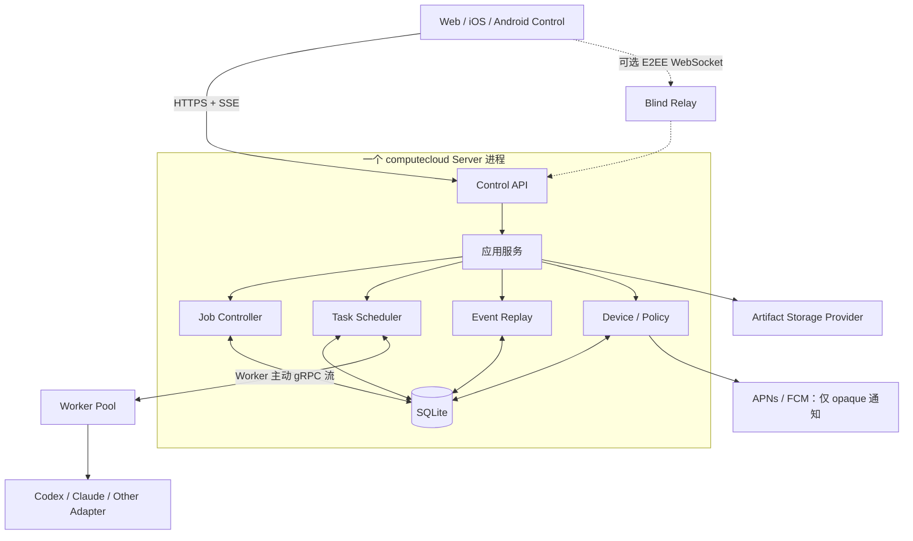
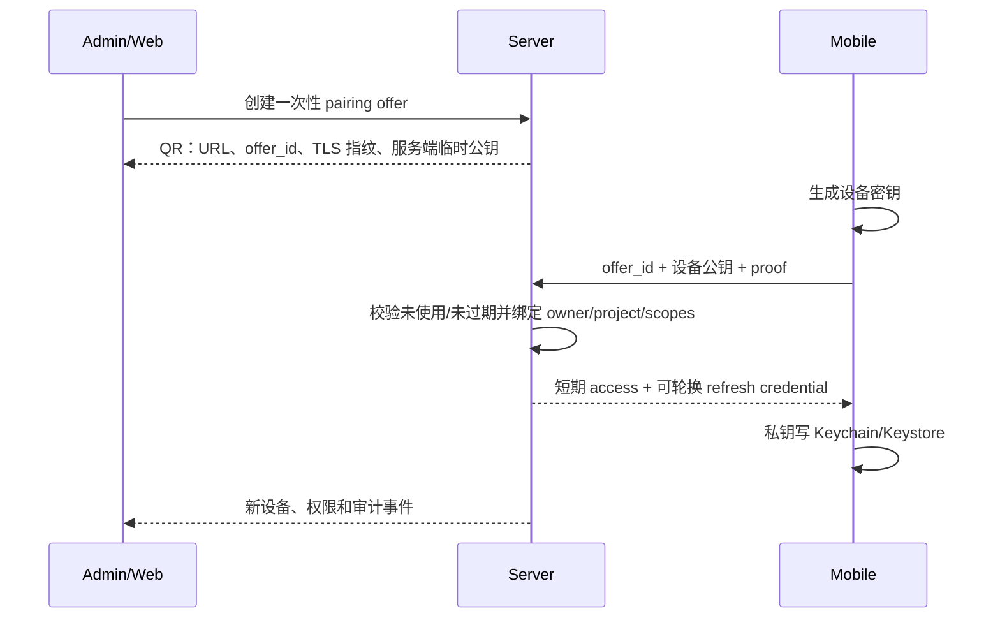

# computecloud Control 客户端控制面技术方案

- 项目：computecloud
- 日期：2026-09-26
- 状态：目标设计；按长期路线图分阶段实施
- 决策依据：[ADR-008](../adr/0008-client-control-plane.md)
- 调研依据：[Agent 客户端控制端方案调研](../research/agent-control-client-landscape-2026.md)
- 路线归属：[Agent Job Executor 长期路线图](../implementation/long-term-roadmap.md)
- 现有基线：[v0.3.2 Artifact Lifecycle](../implementation/v0.3.2-plan.md)、[v0.3.2 验证记录](../validation/v0.3.2-results.md)、[v0.2 接口契约](../contracts/job-gateway-v0.2.md)

## 1. 定位

**computecloud Control** 是 Agent Job Executor 的 Web、iOS 和 Android 控制客户端。它把 Server 已经持久化的 Job、Task、Attempt、Worker、事件、审批、结果和 Artifact 投影到适合移动场景的界面，并允许用户执行经过鉴权、幂等和代次隔离的控制操作。

它不是：

- 新的调度器、工作流引擎或 AI Execution OS。
- Codex/Claude 终端的屏幕镜像。
- 模型 Token Gateway 的替代品。
- 手机本地 Agent Worker。
- Server 状态的第二个事实源。

## 2. 目标与非目标

### 2.1 目标

1. 在手机和浏览器上提交、观察、引导和终止长时间 Agent Job。
2. 在弱网、进程重启和事件重连后保持状态一致，不产生重复副作用。
3. 支持多 Agent、多模型、多 Worker 的结构化视图，而不是只展示终端文本。
4. 让审批、问题回复、Diff/测试结果和 Artifact 在移动端可安全处理。
5. 保持单 Go Server + SQLite，无需为首版部署 PostgreSQL、Redis、MQ 或独立 BFF。
6. 允许后续接入可选 E2EE Relay，而不改变 Job/控制协议。
7. 通过 capabilities 和版本协商支持 Server、Worker、Web 和 App 独立升级。

### 2.2 非目标

- 首版不提供移动 IDE、完整 Shell、Git rebase/冲突处理或任意文件编辑。
- 首版不把客户端消息转换为未验证的 PTY 按键。
- 不允许离线客户端排队取消、审批、重试等高风险操作后静默执行。
- 不提供跨 Codex/Claude 私有会话格式迁移。
- 不承诺手机后台运行时、持续网络或本地存储满足 Worker 租约要求。
- 不因控制 App 上线而提前实现多 Server HA 或外部数据库。

## 3. 核心原则

| 原则 | 约束 |
| --- | --- |
| Server 权威 | Job/Task/Attempt 状态仅由 computecloud Server 提交；客户端只持有投影 |
| 结构化优先 | UI 使用状态、事件、审批和 Artifact 契约；终端输出仅作诊断 |
| 明确证据 | 断线显示 `UNKNOWN/UNVERIFIABLE`；不得渲染为已停止、已取消或可重试 |
| 幂等操作 | 每个提交和控制请求携带 `operation_id`/现有 `control_id`，相同键异参冲突 |
| Attempt fencing | 写操作携带 `expected_attempt_id`、`expected_generation` 和资源版本 |
| 最小权限 | 设备 Token 按 owner/project/action 授权，不接触上游模型密钥 |
| 传输可替换 | 直连 HTTPS、VPN 和 E2EE Relay 使用同一上层消息语义 |
| 渐进交付 | PWA 观察 → PWA 控制 → 原生 App → Relay/治理 → 生产规模 |

## 4. 目标架构



首版图中虚线 Relay 和推送均不启用。现有 `:7444` HTTPS 承载 Job/MCP/Gateway；Control API 复用同一监听器、鉴权中间件和进程内应用服务，不复制 Job 逻辑。

### 4.1 平面划分

| 平面 | 职责 | 不负责 |
| --- | --- | --- |
| Control Client | 展示、输入、审批、控制意图、本地安全存储 | 调度、租约、终态判断 |
| Control API | 鉴权、投影、幂等操作、事件流、设备会话 | 启动 Agent、保存模型密钥 |
| Job Control Plane | Job/Task/Attempt、状态机、配额、公平性、回收 | 移动 UI 生命周期 |
| Worker/Data Plane | 工作区、Agent 进程、事件、验收、Artifact | 用户身份和设备配对 |
| Token Gateway | 模型路由、供应商凭据、用量边界 | Job 调度和设备身份 |
| Relay | 密文帧转发和连接限流 | 解密内容、鉴权决策、状态推断 |

## 5. 客户端产品结构

### 5.1 信息架构

| 页面 | 首要信息 | 可用阶段 |
| --- | --- | --- |
| Home | 运行中、等待介入、最近失败、Worker 健康 | C1 |
| Jobs | 状态、模式、模型、阶段计数、blocker、更新时间 | C1 |
| Job Detail | Task/Attempt、结构化事件、期限、用量、结果 | C1 |
| Attention | 问题、审批、取消不确定、重试建议 | C2 |
| New Job | 项目、仓库基线、模板、模型、分片和期限 | C2 |
| Artifacts | 报告、Diff、测试、哈希、下载 | C1/C2 |
| Workers | 节点、runtime/model capability、槽位、失联状态 | C3 |
| Devices | 配对设备、权限、最近活动、撤销 | C4 |
| Audit | 谁在何时对哪个版本执行了什么操作 | C4 |

### 5.2 移动交互约束

- 默认展示需要行动的对象，不在小屏复制桌面 Dashboard。
- 审批必须显示命令/工具、目标、风险级别、策略依据、Attempt 和有效期。
- 取消按钮先显示“已受理”，只有收到停止和清理证据后才显示“已取消”。
- 追加输入明确区分 `queue_next` 和 `steer_current`；Server/Adapter 不支持时禁用，不退化为 PTY 文本。
- Diff 首版为只读；大文件、二进制和超限内容只显示元数据并允许受控下载。
- 所有危险操作要求重新确认；高风险审批可要求设备生物识别，但服务端授权不能依赖客户端声称。

## 6. API 与协议

### 6.1 复用 v0.2 接口

以下接口继续作为 Job 资源的规范入口：

- `POST /v1/jobs`
- `GET /v1/jobs/{id}`
- `GET /v1/jobs/{id}/tasks`
- `GET /v1/jobs/{id}/events`
- `POST /v1/jobs/{id}/cancel`
- `GET /v1/jobs/{id}/result`
- `GET /v1/jobs/{id}/artifacts`
- `GET /v1/jobs/{id}/artifacts/{artifact_id}`
- `GET /v1/capabilities`

Control 不建立平行 `/mobile/jobs`。需要适合 UI 的投影时扩展现有资源或增加 `/v1/control/*` 聚合读取，底层仍调用同一个应用服务。

### 6.2 C1 只读扩展

| 方法 | 权限 | 语义 |
| --- | --- | --- |
| `GET /v1/jobs?cursor=&limit=&state=&attention=` | `jobs:read` | owner/project 范围内稳定分页；返回 snapshot watermark |
| `GET /v1/workers?cursor=&limit=` | `workers:read` | Worker capability、槽位和权威 liveness |
| `GET /v1/control/bootstrap` | 已鉴权 | Server/API 版本、能力、用户范围、限制和事件水位 |
| `GET /v1/jobs/{id}/events/stream?after_seq=` | `jobs:read` | SSE；先补历史再推送；断线不影响 Job |

SSE 事件使用 SQLite 中已提交的 Job event 序号。内存 channel 只是唤醒；漏通知时重新查库。每条 SSE 包含 `id: <seq>`，客户端用 `Last-Event-ID` 或 `after_seq` 续接。事件被保留策略清理导致游标过旧时返回 `EVENT_CURSOR_EXPIRED`，客户端重新获取快照，而不是拼接不完整历史。

### 6.3 C2 交互扩展

仅在 Runtime 对应能力已经实现并通过固定版本验收后开放：

| 方法 | 权限 | 必要字段 |
| --- | --- | --- |
| `POST /v1/jobs/{id}/inputs` | `jobs:control` | `operation_id`、`task_id`、`expected_attempt_id/generation`、`mode`、`content` |
| `POST /v1/jobs/{id}/approvals/{request_id}` | `approvals:respond` | `operation_id`、Attempt fencing、`decision`、`request_version` |
| `POST /v1/jobs/{id}/retry` | `jobs:retry` | `operation_id`、失败 Attempt、策略/模板摘要确认 |
| `POST /v1/jobs/{id}/pause` | `jobs:control` | 仅适用于明确支持 pause 的 Runtime；否则 capability error |
| `POST /v1/jobs/{id}/resume` | `jobs:control` | 明确 Session/Checkpoint，不允许 `--last` 语义 |

统一写入规则：

1. 校验设备、用户、项目、作用域和资源版本。
2. 用 `(principal, operation_id)` 查询操作回执；同参重放返回原结果，异参返回冲突。
3. 校验 Job 未终态、目标 Attempt 仍权威、请求未过期。
4. 在一个短事务写控制意图、回执和事件。
5. 由现有持久命令通道下发 Worker；HTTP 202 只表示已受理，不表示 Agent 已执行。
6. 原生适配器确认后写独立 accepted/rejected 事件。

### 6.4 错误语义

| 错误 | 客户端行为 |
| --- | --- |
| `CAPABILITY_UNSUPPORTED` | 禁用对应操作，显示固定 Server/Runtime 版本信息 |
| `ATTEMPT_FENCED` | 丢弃本地写入面板，刷新当前 Attempt，不自动重发 |
| `OPERATION_CONFLICT` | 显示原 operation 和当前请求摘要差异 |
| `RESOURCE_VERSION_CONFLICT` | 刷新审批/Job；要求用户基于新状态重新决策 |
| `EVENT_CURSOR_EXPIRED` | 获取新快照和 watermark，再重建订阅 |
| `EXECUTION_UNVERIFIABLE` | 显示未知，不提供一键重试或释放 |
| `PERMISSION_BLOCKED` | 显示策略依据；只有明确授权路径才能创建新操作 |

## 7. 状态同步模型

### 7.1 首次加载

1. 调用 `control/bootstrap` 获取能力、身份范围和 server epoch。
2. 拉取 Jobs/Attention/Workers 快照，保存每类 watermark。
3. 对关注的 Job 使用 `events/stream` 从 watermark 继续。
4. 合并事件时要求 `(server_epoch, job_id, seq)` 单调；重复事件幂等忽略。

### 7.2 重连

- 短断线：携带 `Last-Event-ID` 续接。
- Server 重启但数据库连续：server epoch 变化，客户端保留资源缓存但重新 bootstrap 和验证水位。
- 数据恢复/回滚：返回新的 dataset ID；客户端清除权威缓存并全量同步。
- 设备离线期间：只允许保存草稿和 UI 偏好。取消、审批、重试、输入不进入离线副作用队列。

### 7.3 多设备控制

C1 所有授权设备可同时读取。C2 交互会话引入短期 `write_lease`：

- Lease 绑定 principal、device、Job/Session 和版本，默认 60 秒，通过活动续租。
- 审批和取消等资源操作仍以服务端版本/fencing 为最终条件，不因持有 UI Lease 绕过校验。
- 新设备可以显式接管，原设备收到 `control.revoked` 并变为只读。
- 没有 Lease 不影响观察、Artifact 下载或新建独立 Job。

## 8. 身份、配对与密钥

### 8.1 阶段化身份

| 阶段 | 身份方式 | 边界 |
| --- | --- | --- |
| C1 内部 PWA | 现有静态 Bearer Token，新增最小只读 scope | 仅可信网络/VPN，不作为正式移动发布 |
| C2 PWA 控制 | 短期用户会话 + CSRF/Origin 检查 + 细分 scope | 不把长期管理 Token 写入浏览器存储 |
| C3 原生 Beta | 一次性 QR 配对，设备公钥和 refresh credential | Keychain/Keystore 保存私钥；Server 可撤销 |
| C4 企业 | OIDC/SSO、RBAC、Trusted Device、条件策略 | 设备和用户授权同时成立 |

### 8.2 配对流程



Pairing offer 单次使用、短时有效，不携带长期 Token。二维码泄露最多产生一个待确认请求；正式设备激活可以要求原管理会话确认。

### 8.3 Relay E2EE

C4 才引入 Relay。直接 HTTPS 已由 TLS 保护；Relay 场景额外使用应用层 E2EE：

- X25519 派生会话密钥，HKDF 做上下文分离。
- XChaCha20-Poly1305 或经审计等价 AEAD 封装帧。
- 每方向独立递增序号、重放拒绝、过期和密钥轮换。
- Relay 只持有房间/限流元数据，不持有明文和长期解密密钥。
- 握手或密钥校验失败时 fail closed，不降级成明文 Relay。
- Job API 仍在 Server 端鉴权；E2EE 不替代用户/设备权限。

## 9. Push 通知

Push 是注意力提示，不是可靠事件通道：

- APNs/FCM Payload 只包含 `notification_type`、opaque `event_ref` 和无敏感标题模板。
- 不包含提示词、终端输出、代码、仓库路径、模型密钥或审批正文。
- App 打开后用设备凭据从 Server 拉取权威内容。
- Token 轮换、失效和设备撤销在 SQLite 中管理；投递失败不改变 Job 状态。
- Server 重启后可根据未确认 attention 重新计算通知，但必须去重和限频。

为了保持单体，C3 可先由 Server 内部异步发送；事务仅写 notification outbox，网络发送在事务外。只有测量证明需要独立扩展时再拆 Push Gateway。

## 10. SQLite 数据扩展

按阶段增加，不在 C1 一次创建全部表：

```text
client_devices
  device_id, owner, display_name, public_key, scopes_json,
  status, created_at, last_seen_at, revoked_at

device_credentials
  credential_id, device_id, token_hash, expires_at,
  rotated_from, revoked_at

control_operations
  principal_id, operation_id, request_hash, resource_type,
  resource_id, expected_version, state, receipt_json, created_at

write_leases
  resource_type, resource_id, lease_generation,
  principal_id, device_id, expires_at

push_endpoints
  endpoint_id, device_id, provider, token_ciphertext,
  status, updated_at

notification_outbox
  notification_id, device_id, event_ref, category,
  not_before, attempt_count, state
```

设备私钥不进入 Server。长期 Token 只保存不可逆哈希；Push provider token 按服务端密钥加密。迁移遵循现有 `PRAGMA user_version` 门槛，旧二进制必须拒绝新库，不静默降级。

## 11. 客户端实现

### 11.1 技术栈

- React Native + Expo + TypeScript：Web、iOS、Android 共用资源模型和大部分界面。
- Expo Router：共享导航和 deep link。
- TanStack Query 或小型等价层：服务端状态缓存；不把 Job 复制为客户端状态机。
- SQLite：可重建只读缓存、事件窗口和草稿。
- SecureStore/Keychain/Keystore：设备私钥与 refresh credential。
- 原生 Push、二维码扫描、生物识别：按平台适配。
- 运行时 Schema 验证：客户端拒绝未知必需字段，忽略未知可选字段。

首版 PWA 可以复用同一 Expo 工程，但不能为了代码共享牺牲 Web 安全头、键盘可访问性或大屏信息密度。

### 11.2 仓库布局

初期保留 Monorepo，避免协议漂移：

```text
clients/control/            Expo App：web/ios/android
clients/control/src/api/    生成的 API types 与手写薄客户端
api/control/v1/             OpenAPI/JSON Schema 与事件契约
internal/server/            复用现有 HTTP 应用服务
internal/store/             按阶段增加设备/操作/通知迁移
```

Go 的默认 `make build/test` 不依赖 Node；客户端使用独立 `make control-check` 和 CI job。Server Release 不捆绑 App Store 产物，版本通过协议范围协商。

## 12. 安全威胁与控制

| 威胁 | 控制 |
| --- | --- |
| QR 被截屏 | 短期、单次 offer；设备公钥绑定；原会话确认 |
| 手机丢失 | 每设备凭据、服务端撤销、Keychain/Keystore、生物识别门槛 |
| 旧客户端取消新 Attempt | expected attempt/generation + resource version fencing |
| Relay 被攻陷 | 应用层 E2EE、序号/重放保护、Relay 无明文密钥 |
| Push 泄密 | 仅 opaque event_ref；内容打开后拉取 |
| XSS/Token 窃取 | PWA 不存长期管理 Token；CSP、Origin、CSRF、短会话 |
| 越权 Artifact | 每次下载校验 owner/project/job；短期引用；SHA-256 |
| 日志泄露 | 不记录输入正文、设备密钥、Bearer、Push token；敏感字段结构化脱敏 |
| 恶意 Agent 请求审批 | 展示工具、参数、目标、风险、策略；高风险默认拒绝且不可批量盲批 |
| 客户端版本过旧 | minimum supported protocol、capability 协商、服务端 kill switch |

## 13. 可观测性

Server 新增但控制基数的指标：

- `control_http_requests_total{route,status}`
- `control_sse_connections`、`control_sse_reconnects_total`
- `control_event_delivery_lag_seconds`
- `control_operations_total{type,result}`
- `control_fenced_operations_total{reason}`
- `control_devices_total{status}`
- `control_push_total{provider,result}`
- `control_relay_connections`、`control_relay_decrypt_failures_total`

不得把 Job ID、设备 ID、仓库、用户或 operation ID 作为 Prometheus label。审计事件保留完整对象引用，但按权限查询并纳入保留策略。

## 14. 故障语义

| 故障 | Server 状态 | 客户端显示/动作 |
| --- | --- | --- |
| App 断网 | Job 不变 | 离线，只读缓存；不排队危险操作 |
| SSE 断开 | Job 不变 | 指数退避并从 last seq 续接 |
| Server 重启 | SQLite 恢复 | 重新 bootstrap；校验 epoch/watermark |
| Worker 失联 | Attempt 进入现有核查路径 | `UNVERIFIABLE`；不显示可安全重试 |
| 控制响应丢失 | 操作回执可能已提交 | 用同 operation ID 查询/重放 |
| Push 失败 | Job 不变 | App 下次同步仍可看到 attention |
| Relay 失联 | Job 不变 | 重新握手；不降级明文或假定 Worker 退出 |
| App 版本不兼容 | Server 拒绝不支持能力 | 引导升级；保留安全只读降级（若协议允许） |

## 15. 交付阶段

客户端阶段与既有主路线绑定，不另起版本体系：

| Control 里程碑 | 对齐主版本 | 交付 | 前置条件 |
| --- | --- | --- | --- |
| C0 设计基线 | v0.3.2 | 调研、ADR、API/安全/UX 设计、契约草案 | 本文档合入即完成 |
| C1 Observe PWA | v0.3.3+ | Jobs/Tasks/Attempts/Workers/Artifacts、SSE、attention 只读视图 | v0.3.0–v0.3.2 已完成；补 Job list、稳定事件 cursor、查询投影 |
| C2 Operate PWA | v0.4.x | 提交、取消、输入、审批、重试、只读 Diff/测试 | Runtime 原生输入/审批能力逐项验收 |
| C3 Mobile Beta | v0.5.x | Expo iOS/Android、QR 配对、Push、主机/模型/运行时选择 | Agent-aware Scheduler、设备身份 |
| C4 Governed Remote | v0.6.x | OIDC/RBAC、设备策略、审计、单写者 Lease、可选 E2EE Relay | 治理模型和威胁测试通过 |
| C5 Production | v0.7.x/v1.0 | 弱网/规模、兼容矩阵、商店发布、SLO、企业分发 | Scale/Resilience 门槛完成 |

## 16. 验收矩阵

| ID | 场景 | 预期证据 |
| --- | --- | --- |
| C-V01 | 相同 operation ID 重复提交 | 只产生一个副作用；异参明确冲突 |
| C-V02 | 旧 App 操作已重试的新 Attempt | `ATTEMPT_FENCED`；新 Attempt 不受影响 |
| C-V03 | SSE 在任意事件后断开 | 从序号续接，无丢失、无重复副作用 |
| C-V04 | Server 重启/恢复备份 | epoch/dataset 变化被识别，客户端重新同步 |
| C-V05 | Worker 断网但进程状态未知 | App 显示 unverifiable，不提供假取消/假重试 |
| C-V06 | 两设备同时写同一交互会话 | 一个 Lease 生效；接管有审计和撤销事件 |
| C-V07 | 二维码重复使用/过期/被截取 | 拒绝或进入待确认，不签发第二设备凭据 |
| C-V08 | 设备撤销后持有旧 refresh/access | 刷新和控制失败；在途请求受版本/时间限制 |
| C-V09 | Push provider 读取 payload | 无提示词、代码、路径、审批正文和密钥 |
| C-V10 | Relay 记录全部帧并被攻陷 | 只能看到密文和最小路由元数据 |
| C-V11 | Artifact 越权、截断、hash 错误 | 下载拒绝或校验失败；不呈现为可信结果 |
| C-V12 | 旧/新 Server 与 App 混合 | capabilities 控制 UI；未知可选字段兼容，必需能力拒绝 |
| C-V13 | 1000 活动 Job、慢客户端 | Server 内存有界；慢客户端不阻塞 Worker 事件入库 |
| C-V14 | App 后台/被系统杀死 | Job 继续；重开后从 Server 恢复 |
| C-V15 | App 离线点击取消/批准 | 不静默排队；恢复网络后要求基于新状态确认 |

## 17. CI 与发布

### 17.1 CI

新增独立客户端 job，不改变现有 Go 发布门槛：

- TypeScript 类型、lint、单元测试和 Expo Web build。
- 根据 `api/control/v1` 生成/校验客户端类型，禁止手写契约漂移。
- 使用真实 computecloud Server + fixture Worker 跑 Playwright PWA 流程。
- C2 后增加重复控制、stale Attempt、SSE 断连/重连测试。
- C3 后增加 Android/iOS 构建检查、Deep Link、SecureStore 和 Push 模拟。
- C4 增加 E2EE 协议向量、fuzz、重放、密钥轮换和 Relay 全面失陷测试。

### 17.2 发布

- PWA 静态产物与 Server 二进制分别签名和校验；可选择由 Server 内嵌托管，但版本仍独立。
- 原生 App 使用独立语义版本和 build number；发布说明列出支持的 Server 协议范围。
- CI 生成 SBOM、来源证明、SHA-256；商店签名密钥不进入普通 CI 日志或仓库。
- Server 必须支持按协议版本/客户端版本关闭有风险的写能力，不影响只读查询。

## 18. 首个实施切片

C1 不从登录页和视觉系统开始，而按以下顺序：

1. 设计并测试 `GET /v1/jobs` 稳定分页、filter 和 snapshot watermark。
2. 在现有事件页之上增加 SSE，验证重启、慢客户端和 cursor expiry。
3. 增加 `control/bootstrap` 与 capabilities contract test。
4. 建立 `clients/control` Expo 工程，只实现只读 Jobs/Job Detail/Attention/Artifacts。
5. 用现有 `ci-flow` fixture 驱动 PWA E2E，证明 single、Map/Reduce、取消不确定和 Worker 故障显示正确。
6. C1 验收后再开启 C2 写接口设计，不用 PTY 模拟填补 Runtime 能力空缺。

这样首个客户端版本本身就验证 Agent Job Executor 的可靠性语义，而不是只验证页面能否显示。
