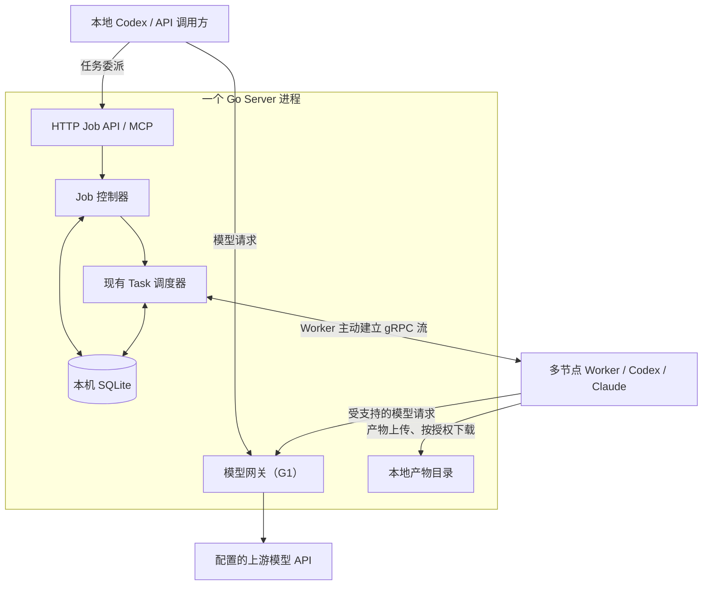
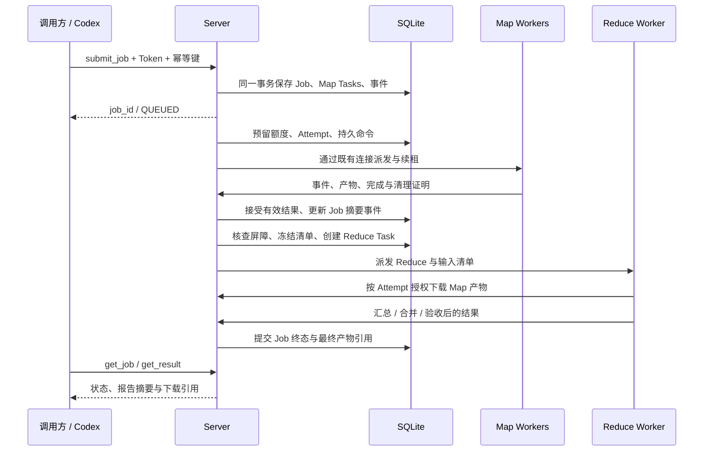

# Token 网关与 Map/Reduce 作业设计

- 项目：computecloud；设计版本：2；日期：2026-09-22。
- 状态：v0.2 已实现并通过本地 fixture 验证；真实客户端、上游和双机验收见[验证记录](../validation/v0.2-results.md)。
- 基线：代码提交 `576713d`、交付文档提交 `2869aea`；单 Go 二进制、单活动 Server、本机 SQLite、多节点 Worker。
- 配套：[接口与数据契约](../contracts/job-gateway-v0.2.md)、[实施计划与验收](../implementation/v0.2-plan.md)、[ADR-002](../adr/0002-gateway-mapreduce.md)。

## 1. 决策与范围

Server 增加统一 Token 鉴权的任务 HTTP API 和 MCP 入口，在现有 Task 调度器之上增加 Job 控制器，组织显式 Map→Reduce。可选模型网关与这些模块放在同一进程，负责 Codex Responses 请求的转发；模型请求不触发 Job 创建。

“Token”在接入处指 Bearer 凭据，在用量统计处指模型输入/输出 token。两者分别管理。平台签发的接入 Token 不是上游模型账号凭据，也不会把 CLI 登录状态自动转换成通用 API 额度。

| 调用需求 | 入口 | 执行位置与返回值 |
| --- | --- | --- |
| 业务系统提交远端 Agent 任务 | `POST /v1/jobs` | Worker 运行 Codex/Claude；立即返回 Job ID |
| 本地 Codex 委派远端任务 | `/mcp` 的 `submit_job` 等工具 | 本地 Codex 获取 Job 状态与产物，远端执行 |
| Codex 统一经过模型代理 | `POST /v1/responses` | 模型推理转发给配置的上游；工具仍由原调用方执行 |

Codex 官方配置支持自定义模型提供方和远程 HTTP MCP。[S1][S2] 模型工具调用是应用与模型之间的多次交互，远端 Agent 任务还需要仓库、工作区、权限和验收信息。[S3] 因此，直接把每个 Responses 请求封装成 `codex exec(prompt)` 不在本版兼容目标内。若未来需要 CLI 作为模型协议后端，另立兼容契约和验收，不与本设计隐式混用。

| 能力 | v0.2 核心 | G1 可选模型网关 | 后续 |
| --- | --- | --- | --- |
| Token、HTTP Job API、Codex MCP | 实施 | 共用身份与服务进程 | — |
| `single`、显式分片、单个 Reduce | 实施 | — | 通用 DAG / 自动 Planner |
| 报告汇总、无重叠补丁合并 | 实施 | — | 冲突自动修复、多轮迭代 |
| 自动重试、备份任务 | 默认禁止，每 Task 仅一次 Attempt | 不改变任务重试规则 | R1：经验证的可重放任务重试 |
| Responses HTTP/SSE、compaction | — | 固定 Codex 版本和上游组合验收后启用 | WebSocket、更多提供方协议 |
| 多 Server / 外部工作流引擎 | — | — | 有实测需求再设计 |

设计覆盖核心、G1 和 R1 的边界；实施先完成核心，G1 独立开关发布，R1 不阻塞 v0.2 核心。核心默认延续受信 Linux 执行环境，工作区隔离和进程组不是不可信多租户沙箱。

## 2. 进程与模块

图中的产物目录只由 Server 的文件接口访问，Worker 不挂载 Server 数据目录。G1 初始只适配 Codex Responses；Claude 仍使用其独立运行时和凭据，不能直接指向 Responses 入口。

- 保留 `:7443` gRPC；新增同进程 `:7444` HTTPS，承载 Job API、MCP 和可选模型入口。避免首版增加同端口协议复用和反向代理依赖。
- HTTP/MCP/gRPC 调用相同的进程内应用服务，不通过本机 RPC 转发，也不复制鉴权、验收和调度实现。
- 一个 Job 控制循环负责有限批次推进，一个现有 Task 调度循环负责资源准入。事务提交后通知 Go channel；丢失通知由定时查库恢复。
- SQLite 只存规格、状态、事件、索引和请求用量记录；大产物落文件。网络传输、模型执行、Git 操作均在事务外。
- 首版不增加独立 Registry；模型路由、运行模板、项目权限均为受信静态配置，引用具有版本和内容摘要。

## 3. MapReduce 的采用边界

Google MapReduce 将分片任务分配给 Worker，并依据中间结果组织 Reduce；其确定性与重复执行假设不能直接用于有工具副作用的 Agent。[S4] 本项目采用下面的有限形式。

| 原概念 | 本项目映射 | 具体约束 |
| --- | --- | --- |
| Master | Job 控制器 + Task 调度器 | 单活动进程，状态从 SQLite 恢复 |
| Map | 明确分片的 Task | 按模块/文件集合拆分；不按 token 数任意切提示词 |
| 中间结果 / Shuffle | 有摘要的产物清单 | 按 partition key 排序；不实现大规模网络排序服务 |
| Reduce | 一个普通 Worker Task | 输入冻结后启动，独立工作区中汇总或合并 |
| 输出提交 | 选定有效 Attempt 的产物 | 条件更新只接受一个结果，不承诺工具恰好执行一次 |
| 重试 / 慢任务备份 | 保守处理 | v0.2 关闭自动重试和推测执行；R1 单独验收 |

Job 层选择运行时和模型；每个 Task 的模型、凭据、基线和模板在接受时冻结，不根据繁忙程度暗中切换。不同模型通过结构化报告和补丁协作，不共享私有 Session。

### 3.1 两种作业

- `single`：一个 Job 管理一个 Task，统一使用 Job 查询、权限、取消和结果格式。
- `map_reduce`：一个 Map 阶段，1–32 个必需分片，全部成功后创建恰好一个逻辑 Reduce Task。请求显式填写并行度 1–8，推荐起步值 2；这些是初始工程限制，不是容量测量结论。

调用方或 MCP 客户端显式提供分片。Server 校验分片数量、唯一 key、路径、模板、权限、总期限和并行度。自然语言 Planner 若后续加入，输出也必须经过相同校验，不能直接改变准入规则。

`scope_paths` 是任务关注范围；读取其他模块可能有助于理解，不代表文件访问安全隔离。`patch_merge_v1` 则额外检查实际修改路径：必须在获准范围内，两个分片的写范围不能存在目录祖先/后代或文件交集。路径必须是仓库相对路径，禁止绝对路径、`..`、NUL 和 Git 元数据路径。

### 3.2 两种 Reduce 策略

`report_merge_v1`：Map 的原生最终输出返回 findings JSON，由 Worker 校验并写成仓库之外的 `findings.json` 产物；只读 Agent 无需写文件。Reduce Worker 先校验所有输入，再让模型去重、交叉核对和生成报告；保留原分片和证据出处。结构校验只证明格式正确，不能证明模型判断必然正确。

`patch_merge_v1`：Map 产出补丁及修改路径清单。Reduce Worker 的受信准备步骤从共同基线建立工作区，按 key 排序检查并应用补丁，再运行只读汇总 Agent 和受信测试。发生实际路径重叠、补丁应用失败或最终测试失败即失败并保留证据。本版不让 Reduce 模型静默重写冲突代码。Reduce Agent 结束后核对最终 diff 与受信应用的补丁一致。

仓库基线使用完整 commit；各节点必须事先具有获准仓库和相同对象。v0.2 核心不接收任意 Git URL、用户自定义 shell 验收命令或未提交改动包；需要处理本地修改时，先形成可访问的固定 commit。避免在首版同时引入仓库分发和输入包生命周期。

## 4. 任务投递与产物交接

### 4.1 提交事务

1. 校验身份、项目权限、请求大小和 JSON；根据 `(owner, project, idempotency_key)` 查询原请求。
2. 已存在时比较规范化客户端请求的摘要；相同返回原 Job，不同返回 `IDEMPOTENCY_CONFLICT`。不能重新解析已变化的默认配置后误建另一个 Job。
3. 新请求解析并冻结模型、运行模板、策略/验收内容摘要；保存独立的 `request_hash` 与 `spec_hash`。
4. 在一个短事务内写 Job、全部初始 Task 和 `job.created`。最多 32 个分片，事务内不复制仓库或启动进程。
5. 持久提交后返回 HTTP 202；确认丢失时调用方使用相同幂等键重试。存储失败不返回接受成功。

### 4.2 资源准入

沿用 runtime、model、credential、repository、policy、verifier、能力和空闲槽位匹配。新增 Job 并行度限制，与项目上限、凭据上限、Worker slots 同时生效；未释放 Attempt 继续计入额度。

同优先级在符合条件的 Job 和独立 Task 之间轮转，每轮每个 Job 最多派发一个子任务，再使用已有创建时间排序。轮转游标可以只在内存中，重启只影响公平性，不影响正确性。没有合格节点时保持排队，并返回具体 blocker。匹配是能力过滤，不支持首版任意资源表达式。

所有子任务继承 Job 的绝对 deadline，排队、Map、Reduce 和验收共享总期限。创建 Reduce 时不能重新获得完整超时。准入事务同时检查 Job 未停止、未到期、子任务仍排队及配额可用。

### 4.3 完成屏障和输入冻结

Reduce 的启动条件是：Job 仍为 `MAPPING`、所有预期分片都存在且 `SUCCEEDED`、获选 Attempt 均已确认清理并释放、所需产物登记且哈希校验通过、尚未取消或超时。

控制器按分片 key 生成最多 32 KiB 的规范 JSON 清单；内容包括共同基线、子任务/Attempt/代次、产物 ID/哈希/字节数/类型及模板摘要。清单保存在 Job 行内，并与 Reduce Task 和 `job.reduce_created` 在同一事务提交。数据库唯一约束 `(job_id, stage, partition_key)` 与 Job 版本 CAS 共同防止重复创建。

Reduce 的分片 key 固定 `_reduce`。控制器重启后使用已存清单，不能重新选择新的产物。输入包下载、解压和验证发生在 Worker；每个文件按清单校验，限总大小，拒绝目录穿越、链接文件和解压膨胀。Worker 不执行来自产物的任意脚本。

现有 `DownloadArtifact` 是用户下载接口；新增 `DownloadInputArtifact` 专用于 Worker，逐次校验目标 Attempt、租约、Worker 身份和冻结清单成员关系，不能授权 Worker 浏览整个项目的产物库。

### 4.4 结果提交

Reduce Task 只有在原生结束、产物校验、受信验收和清理通过后成功。控制器再通过 Job 状态 CAS 发布最终产物引用。Server 在 Task 成功后、Job 成功前崩溃时，恢复控制器完成这一步，不重跑 Reduce。

取消与成功以同一数据库中的条件变更确定先后：成功已提交则终态不再改变；停止意图先提交则禁止新的成功提交和 Reduce 创建。Job 成功不等于补丁已进入源仓库；合并主分支、推送或部署由后续显式操作负责。

## 5. 状态、取消与恢复

| Job 状态 | 意义与主要下一步 |
| --- | --- |
| `QUEUED` | 已持久接受，初始子任务尚未分配 |
| `EXECUTING` | `single` 的 Task 已分配，等待最终结果 |
| `MAPPING` | Map 已开始；排队或执行中的分片受同一 Job 管理 |
| `REDUCING` | Reduce Task 已创建，可能正在排队 |
| `STOPPING` | 已保存用户取消、超时或子任务失败原因，正在终止其余任务 |
| `RECONCILING` | 至少一个执行是否停止尚未确认，保留额度和停止原因 |
| `SUCCEEDED` / `FAILED` / `CANCELED` | 不可变终态；所有相关执行均已清理 |

某 Map 失败时停止其余分片，保留已经完成的产物，不返回部分成功。single/Reduce 失败采用相同停止规则。Job 的首个停止原因在事务中固定；后来的取消请求可以观察已有原因，不能覆盖它。用户取消最终为 `CANCELED`，超时和子任务失败为 `FAILED`。

仅连接断开而租约仍有效时继续等待；任一子 Task 因执行不明进入 RECONCILING 后，核心版本为 Job 固定 `EXECUTION_UNCERTAIN` 停止原因（若尚无原因）并停止其他子任务，禁止继续派发。全部清理确认后按原停止原因结束；不能仅因为网络恢复就把不明执行重跑。

取消操作先持久化 Job 停止意图，使调度器和完成接口立即停止准入/成功接受，再由可恢复的有限批次扇出逐个取消子 Task。queued 子任务直接取消；活动子任务写 Stop 命令。客户端断开、MCP 请求取消或轮询超时，不等于取消已经接受的 Job；必须调用 `cancel_job`。

| 故障点 | 恢复行为 |
| --- | --- |
| Job 提交后响应丢失 | 同幂等键返回原 Job，不重复分片 |
| Start 命令或 ACK 丢失 | 复用现有命令 ID 重传和 Worker 本地去重 |
| Map 上传完成、结果事务未提交 | 原 Attempt 重传完成；未被接受的文件不进入 Reduce 清单 |
| 屏障事务前崩溃 | 重新核查屏障 |
| 屏障事务后、Reduce 下发前崩溃 | 查到同一个 Reduce Task，正常调度 |
| 取消扇出中崩溃 | 从停止意图继续取消，禁止创建新执行 |
| Worker 离线 / 租约到期 | 沿用本地到期停止；Job 进入 RECONCILING，v0.2 不重派 |
| 旧执行无法证明清理 | 保留非终态和额度；人工核查，不做强制释放捷径 |
| Reduce 输入丢失或哈希不符 | 明确失败，不悄悄重跑 Map 或换另一份文件 |
| SQLite 不可写 / 磁盘满 | 停止新接受和新派发；不发送虚假的持久化 ACK |

### 5.1 R1 的受限重试规则

R1 是后续独立迁移和验收，默认仍为一次 Attempt。只有服务端受信模板明确标记 `replay_safe`、旧执行和子进程已停止、上次结果未被选入下游、仍有尝试次数和剩余期限，才允许新的 Attempt。用户自己声称“幂等”不构成授权依据。

每个 Attempt 的 ID、代次和租约凭据独立，旧 Attempt 终结后才能创建下一代；Task 在重试期间保持非终态。核查暂态故障后用 1/2/4 秒加抖动退避，最大尝试数初始上限 3；权限拒绝、坏输入、补丁冲突、测试失败不自动重试。

代次只阻止迟到结果成为有效结果，不能阻止旧进程已经发出的外部操作。推送、部署、外部数据库写入不属于本版可重放模板。慢任务并发备份执行继续禁用。详细迁移约束见配套契约。

## 6. Token、MCP 与凭据

静态调用方 Token、Worker 身份 Token、上游 API Key 分开配置。复用现有文件凭据与项目授权方式，增加 `jobs:submit/read/cancel`、`models:invoke` 和模型路由白名单；旧 gRPC 用户迁移时保留原任务权限，不自动授予模型网关权限。

- 调用方只能读取自己 owner 和获准 project 的 Job；越权对象返回 404。Token 不放 URL、提示词和日志。
- MCP 采用官方 Go SDK 的固定版本和 Streamable HTTP；核心工具同步快速返回，不维持与 Job 同寿命的 MCP 调用。[S8]
- 每次 MCP 请求均鉴权；校验 Origin 和协议版本。初始化会话不代表授权，也不等于 Codex 原生 Session。[S5]
- Worker 的 Codex 配置默认不装载本平台的 `submit_job` MCP 工具，且只获得执行/模型权限，不能递归创建作业。
- 整个传输层使用 TLS。内网 Token 网关沿用受信节点前提，不增加 SSO/OAuth 服务；未来面向第三方开放时另立身份设计。

G1 中，若需要把 Worker 推理量归属到 Attempt，分配时从该 Attempt 的 256 位随机租约材料、ID、代次和专用域标签派生模型 Token，在 Attempt 行保存哈希，通过受保护的 Assignment 交付。它只允许该 Attempt 的模型路由，不能用于任务提交或 Worker 控制。网关逐次检查当前代次、租约、Job 停止状态和绝对 deadline；租约失效/取消/释放后拒绝新推理并尽力取消已在途请求。

原始模型 Token 只通过受保护的命令传输，并存在于 Worker 私有执行数据中；Server 持久 start 命令不含原文，重放时重新派生，权限与现有租约秘密一致；不在 GetTask、事件、产物中返回。Worker 通过运行时配置和子进程环境注入，不把密钥拼进 shell 命令。服务端上游 API Key 不下发给调用方。

## 7. G1 模型网关

G1 是按白名单上游转发的 HTTP Responses 网关，不是完整 OpenAI 平台模拟器。每个接入身份绑定项目、可用模型和一个固定上游账号路由；模型名称使用上游认可的 ID，不在首版做别名重写和跨提供方故障切换。

支持范围为同步 JSON、SSE、函数/自定义工具调用链、推理/压缩内容的原样交接，以及 `POST /v1/responses/compact`。官方提供独立 compaction 路径，不能把长会话压缩误当成普通文本生成。[S6] WebSocket、后台任务、服务器端会话存储和其他提供方协议显式拒绝。

网关不执行调用方工具，保持消息、call ID、工具参数、工具返回值、推理密文和流事件语义；认证及逐跳 HTTP 头按代理规则处理。Worker 的模型请求只可能转到上游，绝不进入 Job 控制器。

首版采用无服务器端会话引用的子集：`/responses` 的 `store` 缺省时显式设为 false，显式 true 拒绝；拒绝 `previous_response_id`、`conversation`、`background:true`、对象引用和跨请求文件/容器 ID，调用方带齐可传递的上下文。`/responses/compact` 按其独立请求格式转发，不额外插入 store 字段。允许的内联消息与不透明推理/compaction 项保持原样。该选择降低共享上游账号下的对象越权和路由粘性复杂度，仍须实测固定 Codex 版本。

默认不自动重放推理 POST：上游已收到请求但连接中断时是否执行可能不明。流开始后不换账号、不重新生成前半段、不伪造完成事件；记录中断并让客户端决定后续动作。下游断开时取消上游请求，但不能承诺上游即时停止或不产生费用。

按请求限制内存、流持续时间和并发；转发保留背压，SQLite 事务不跨越流生命周期。数据库不可写时拒绝启动要求记录用量的新调用。日志只记请求 ID、路由、状态、耗时和用量，默认不保存提示词/响应正文。

### 7.1 用量与额度

`gateway_requests` 每次请求记录开始和完成；进程崩溃留下的未结算调用标记 `UNKNOWN`。计数包括失败、取消和未来重试的所有 Attempt；用量缺失是 unknown，不填写 0。同一请求的 SSE 用量只结算一次；已使用网关计量的请求不再叠加 CLI 汇总。

OpenAI 用量中的 cached/reasoning 等子项作为明细保留，不再次加入 input/output 总数；其他提供方以后独立定义映射。核心阶段没有全链路计量时返回 `usage.coverage=unavailable/partial`。

本版提供并发硬准入和用量观测，JobSpec 暂不开放 token/费用预算。后续若引入 token 停止阈值，仍需处理并发在途请求、取消延迟及未知用量，不能直接承诺严格费用上限。上游账号/项目共享限额仍然有效，多 Worker 不会增加这些限额。[S7]

## 8. SQLite 与升级

核心 schema v2 新增 `jobs`、`job_events` 两张表，在 `tasks` 增加归属/阶段/分片字段；继续复用 attempts、commands、controls、events、artifacts。Job 事件只记阶段、计数、停止和产物摘要，详细输出仍在 Task 事件中，避免重复存储。

G1 schema v3 再新增请求用量表及 Attempt 模型 Token 哈希字段。R1 后续才重建当前带 `task UNIQUE` 的 attempts 表。v2/v3 是顺序事务迁移，当前 Server 不论 G1 开关均升级到 schema v3；Worker 数据版本升为 2 以阻止旧程序误读新 Assignment。R1 未实施。

升级前暂停接收、排空执行并停止服务，备份完整数据目录，再在独占锁内事务迁移，执行完整性/外键检查后更新 `user_version`。新 Server 保留旧 Task 查询和恢复能力；旧 Worker 可执行独立旧 Task，Job 子任务必须匹配新能力标识。旧二进制拒绝打开新 schema；回退用升级前备份，不直接把版本号改回去。

产物默认保留，不对活动 Job 引用的文件做清理。后续 GC 必须考虑冻结输入清单、最终结果和终态保留期；备份包含 SQLite 和全部被引用的产物。控制节点数据盘损坏仍依赖备份恢复，本设计不新增控制面高可用。

## 9. 实施落点与验收

为保持实现简单，HTTP/MCP/网关适配集中在现有 server 包，Job 数据契约放在 internal/job；没有再增加内部 RPC 或独立服务。见[运行指南](../implementation/v0.2-runbook.md)。

| 路径/模块 | 实现内容 |
| --- | --- |
| `internal/server` | 提取公用授权/提交函数，Job 推进、停止扇出、屏障事务、调度公平性 |
| `internal/store` | 显式版本迁移、Job 唯一约束、事件和摘要查询 |
| `internal/server/http.go`、`mcp.go` | HTTP/JSON 和 MCP 适配，调用同一应用服务 |
| `internal/server/gateway*.go` | 固定路由、流转发、请求用量、Attempt 绑定凭据 |
| `internal/worker`、`internal/workspace` | 输入产物获取、模板摘要核验、报告/补丁策略 |
| `api/agent/v1/runtime.proto` | 可选 Job 执行上下文、输入下载 RPC、能力声明 |
| `internal/config`、`cmd/computecloud` | HTTP 监听、权限、模板和 CLI Job 命令 |

首次端到端验收使用“固定 commit 的多模块代码审查”：两个独立 Linux 节点，至少一个真实 Codex；再以真实 Claude 验证混合运行时。之后验证无重叠代码补丁及受信测试。必须覆盖提交响应丢失、Server 在屏障前后崩溃、取消竞态、Worker 失联和产物损坏。

验收记录必须区分 fixture、本机双进程、真实模型和独立双机。G1 额外验证固定 Codex 的多轮工具、SSE、compaction、取消及错误行为；未通过不能仅凭 `base_url` 可配置就宣称兼容。完整任务和通过条件见[实施计划](../implementation/v0.2-plan.md)。

## 10. 来源与核查边界

核查日期：2026-09-22。以下是接口和历史机制依据；分片上限、状态机、schema、权限和阶段划分是本项目设计，不是供应商能力或性能承诺。

- [S1：Codex Advanced Configuration](https://developers.openai.com/codex/config-advanced)
- [S2：Codex MCP](https://developers.openai.com/codex/mcp)
- [S3：OpenAI Function calling](https://developers.openai.com/api/docs/guides/function-calling)
- [S4：Dean / Ghemawat，MapReduce: Simplified Data Processing on Large Clusters，OSDI 2004](https://research.google/pubs/mapreduce-simplified-data-processing-on-large-clusters/)；[论文](https://storage.googleapis.com/gweb-research2023-media/pubtools/4449.pdf)
- [S5：MCP Streamable HTTP，2025-11-25 版协议](https://modelcontextprotocol.io/specification/2025-11-25/basic/transports)
- [S6：OpenAI Compaction](https://developers.openai.com/api/docs/guides/compaction)
- [S7：OpenAI Rate limits](https://developers.openai.com/api/docs/guides/rate-limits)
- [S8：官方 MCP Go SDK](https://github.com/modelcontextprotocol/go-sdk)
