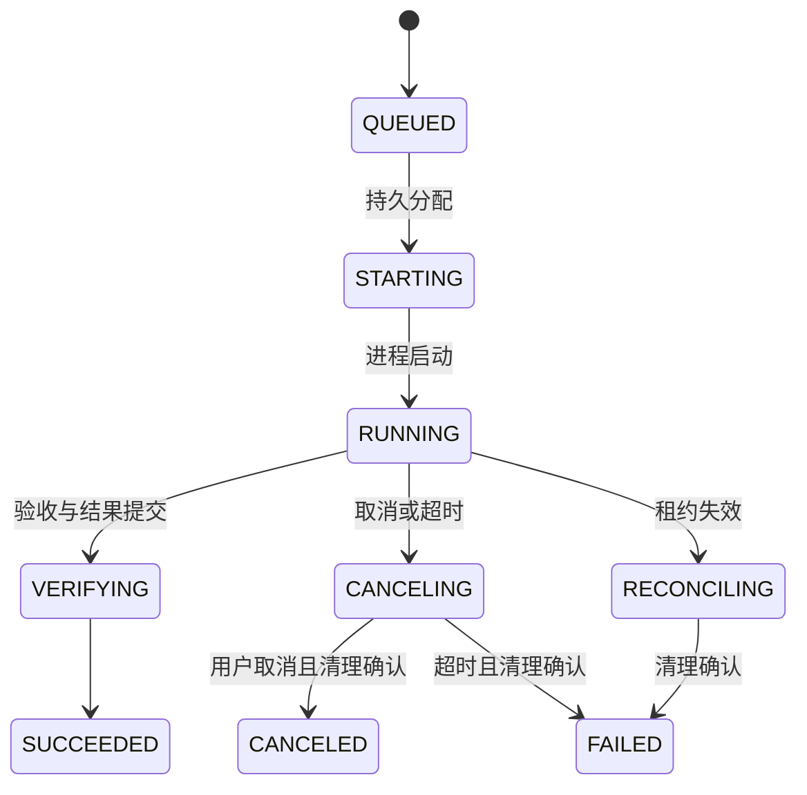

# v0.1 构建、运行与恢复

日期：2026-09-22。适用：computecloud 0.1.0，受信 Linux 节点，单活动 server。

## 1. 构建与部署内容

控制节点只需要 `computecloud`、配置、令牌/证书与本地数据目录。每台执行节点额外安装 Git、要启用的 Codex/Claude CLI 和任务所需工具。构建需要 Go 1.26+，本版验证使用 Go 1.27.1；运行二进制无需 Go、C 编译器或独立 SQLite 服务。

```sh
make build
./bin/computecloud version
make test
# race 检查需要 C 编译器；发布构建使用 CGO_ENABLED=0
make vet race
# Python 3.12+；自动创建并清理测试仓库、令牌、配置与数据
make smoke
```

常规构建不需要 protoc。`api/agent/v1` 已包含生成的 Go 客户端/服务端；修改协议后用 `make generate`。本版生成器为 protoc-gen-go v1.36.12、protoc-gen-go-grpc v1.6.2。

## 2. 本机接入真实 CLI

先在 Worker 的运行用户下安装、登录并独立验证客户端，记录完整版本输出。只启用一个执行器时，删除另一个 runtime 配置。

```sh
codex --version
claude --version
mkdir -p secrets
chmod 700 secrets
umask 077
openssl rand -hex 32 > secrets/user.token
openssl rand -hex 32 > secrets/worker-a.token
```

令牌至少 24 个字符，用户和各 Worker 必须不同。生成命令用于首次初始化，已有系统不要覆盖令牌。`secrets/`、`data/` 和 `bin/` 已被 Git 忽略。

编辑 `examples/server.yaml`、`worker.yaml`、`client.yaml`、`task.json`：

1. runtime.version 填对应 CLI 完整 `--version` 输出，启动时严格匹配。版本检查不等于账号验证。
2. 替换模型占位符，保持 server 默认模型与 worker 允许模型一致。任务省略 model 时，server 在接受时解析并保存默认值。
3. repositories.demo-repo 指向本节点已有 Git 仓库的绝对路径；使用 `git -C /path/to/repo rev-parse HEAD` 获取完整 commit 并填入任务。接受完整 40 或 64 位十六进制 commit；每个任务独立 clone，不覆盖缓存仓库。
4. 凭据引用是静态名称。默认使用 Worker 用户已登录的 CLI；API key 可通过 `credential_env.<ref>.<ENV_NAME>: <secret-file>` 注入，环境变量名称需符合该 CLI 的认证方式。密钥原值不经 RPC 传输。
5. `inspect` 用于读取，`edit` 允许修改独立工作区。`basic: []` 只检查原生 final、进程退出和结果包，**不验证生成代码正确性**；修改代码应选择受信测试命令，例如示例 go-tests。

相对路径相对于配置文件所在目录；executable 可以是 PATH 中命令名或文件路径。YAML 未知字段会报错。多个节点使用相同策略/验收引用时，应部署相同配置；建议引用名称携带版本，例如 inspect-v1。CLI 仍使用该用户的受信本地配置，Claude 的 allowedTools 是允许参数，不是独立沙箱；部署前检查 CLI 自身已有权限和工具设置。

在两个终端分别启动服务：

```sh
./bin/computecloud server --config examples/server.yaml
./bin/computecloud worker --config examples/worker.yaml
```

操作任务与产物：

```sh
./bin/computecloud workers --config examples/client.yaml
./bin/computecloud task submit --config examples/client.yaml --file examples/task.json
./bin/computecloud task get --config examples/client.yaml --id TASK_ID
./bin/computecloud task watch --config examples/client.yaml --id TASK_ID
./bin/computecloud task watch --config examples/client.yaml --id TASK_ID --after 10
./bin/computecloud task cancel --config examples/client.yaml --id TASK_ID --control-id cancel-001
./bin/computecloud artifact list --config examples/client.yaml --id TASK_ID
./bin/computecloud artifact download --config examples/client.yaml --id TASK_ID --artifact ARTIFACT_ID --out result.tar
```

提交响应中的 task_id 用于后续命令。同 owner/project 下同一幂等 key 与相同解析后参数返回原 Task；异参返回 AlreadyExists。重用 key 时，默认模型配置也应一致，或在请求中明确填写模型。取消可以重用 control-id，受理后需等待终态。

watch 输出 JSONL，payload 是 JSON 对象，seq 为十进制字符串；`--after` 只返回大于指定 seq 的事件。RPC 原字段 payload_json 为 JSON bytes，直接使用 ProtoJSON 时表现为 base64，消费者需按该类型解码。

结果 tar 包含 report.json、changes.patch、stderr.log。报告记录基线、模型配置、原生结果、退出码与验收输出；可对照产物元数据校验 SHA-256。平台不自动向源仓库合并补丁、提交代码或创建 PR。

## 3. 多机与 TLS

为每台 Worker 分配唯一 ID、独立 token 和本地 data_dir，并在 server.workers 登记项目与凭据授权。各节点分别准备仓库和 CLI，不共享 SQLite 或 Worker 数据目录，不在两台机器同时使用同一个 Worker ID。

远程连接必须使用 TLS。`insecure_loopback: true` 仅允许字面量回环地址，例如 127.0.0.1:7443，不允许 0.0.0.0、远端 IP 或域名。将以下字段合并到完整配置，删除原 insecure_loopback 设置：

```yaml
server:
  listen: 0.0.0.0:7443
  tls:
    cert_file: /etc/computecloud/server.crt
    key_file: /etc/computecloud/server.key
```

```yaml
worker:
  server_address: computecloud.example.internal:7443
  tls:
    ca_file: /etc/computecloud/ca.crt
client:
  address: computecloud.example.internal:7443
  tls:
    ca_file: /etc/computecloud/ca.crt
```

证书 SAN 必须包含实际访问域名或 IP。采用系统信任 CA 时可省略 ca_file。首版是 TLS 服务端认证 + Bearer 令牌，没有 mTLS 或自动证书签发。

可用现有 systemd 托管相同命令。Worker 应使用独立运行用户、HOME 与数据目录；CLI 登录状态属于该用户。平台进程组监督不是不可信多租户沙箱，也没有容器/cgroup 启动器。

## 4. 调度、状态与资源

按 runtime、模型、凭据、仓库、策略、验收模板和能力匹配节点；队列按优先级和创建时间扫描，在合格节点中选择占用槽位较少的节点。账号总并发、项目并发和节点槽位同时限制准入。不匹配或容量不足时保持 QUEUED 并返回 blocker，不自动更换模型或账号。



图中省略排队取消、启动失败等短路径。VERIFYING 在结果提交事务内记录，可能只在事件中可见；验收实际运行在 Worker。deadline 从提交开始，排队时间计入 timeout。每个 Task 只创建一个 Attempt，租约过期不自动重派。

| 限制 | 默认或实现 |
| --- | --- |
| Worker slots | 默认 2；server 接受 1–64 |
| 租约 | 默认 60 秒；每秒续租，100ms 检查本地期限，提前 500ms 停止 |
| 调度 tick | 500ms；命令每秒补发直到持久 ACK |
| 项目并发 | 默认 8；凭据并发通过 server.credentials 配置 |
| 任务 timeout | 默认 1800 秒；接受 1–86400 秒 |
| 提示词 / 最终结果 | 各 1 MiB |
| 原生单行 JSON / gRPC 消息 | 4 MiB / 8 MiB |
| Worker 未确认事件 | 每 Attempt 约 256 MiB 上限；超限停止执行 |
| stderr / 每条验收输出 | 各保留最多 1 MiB，并标明截断 |
| 结果包 | Worker 32 MiB；server 默认同值，可收紧 |

只有清理确认才释放额度。暂时断网时事件写入本机 SQLite，Worker 本地租约到期后停止任务，重连后补传。RPC 可以重传，模型任务不会自动重新执行。

SQLite 每进程单连接，WAL、synchronous=FULL、foreign_keys=ON、busy_timeout=1000ms，短事务使用 immediate 写锁。instance.lock 拒绝同目录第二实例。server 与各 Worker 的数据库均叫 state.db，位于不同本地目录。

## 5. 故障、维护与备份

维护前停止提交并等待任务结束，或取消后等待清理。`maintenance: true` 拒绝新提交并暂停新派发，仍处理已有任务上报；这是启动配置，没有热重载。

Worker 收到 SIGTERM 会停止任务并尽力上报，未交付记录留在本机数据库。server 重启恢复任务、事件和待发命令；Worker 按命令 ID 去重，开始执行前还需要有效租约。Worker 崩溃重启会读取 PID、boot ID、启动时刻并停止已记录的进程组，报告中断，不重新运行模型任务。

**RECONCILING/CLEANUP_UNCONFIRMED：** 若进程启动后尚未记录 PID 就崩溃，无法证明旧进程不存在，保留额度。首版没有通用 Inspect/强制释放管理命令，需要停派发、隔离并人工核查原节点，保留数据库和进程证据再处理；不能删除日志或直接改终态来绕过。自行脱离进程组的子进程不在此隔离模型的保证范围内。

排空执行并停止 server 后进行离线备份：

```sh
./bin/computecloud backup --data-dir ./data/server --out ./backup-20260922.tar.gz
```

命令获取目录锁，拒绝运行中的 server 或尚未释放的 Attempt，执行 integrity_check，关闭数据库后打包 SQLite 与产物。输出必须是新文件且位于数据目录之外；不支持直接在线复制单个 .db 文件。

恢复自己生成并保管的备份到空目录：

```sh
mkdir -m 700 restored-server
tar -xzf backup-20260922.tar.gz -C restored-server
```

保留原目录，修改 data_dir 指向恢复目录，先以 maintenance 模式检查任务和产物。旧节点必须排空或隔离后才能重新开放派发，禁止新旧 server 同时管理一组 Worker。配置、令牌、证书、CLI 登录和 Worker 数据不包含在 server 备份内，需要另行保存。不要将过期 server 快照与任意 Worker 状态直接拼接。

本版不自动进行事件保留、任务删除或工作区 GC；观察磁盘用量并定期排空、备份，不在运行中删除数据库、WAL、执行日志或活动工作区。容量与吞吐尚未负载测试。

## 6. 与目标设计的差异

| 设计项 | v0.1 实现 |
| --- | --- |
| 注册、续租、ACK | 合并到 ConnectWorker 帧；事件/产物单独 RPC |
| 序号 | Proto 非负 int64，与 SQLite INTEGER 对齐；以 runtime.proto 为准 |
| server 表 | 7 张：tasks、attempts、workers、commands、controls、events、artifacts；取消幂等独立放 controls |
| 执行次数 | 一个 Task 一个 Attempt；generation=1；失败后用新 key 提交新 Task |
| Session | 原生 ID 仅作结果元数据；session_ref 拒绝，不建立会话表或会话锁 |
| 动态输入 / 审批 | SendInput、RespondApproval 返回 Unimplemented |
| provider / 预算 / placement / 附件 | provider_ref 非空拒绝；其余扩展未加入首版 Proto；无费用硬上限 |
| 策略 / 验收 | 节点静态配置；没有跨节点配置摘要强制校验，运营者保持同引用同配置 |
| 仓库 / 隔离 | 预配置本地仓库、独立 clone、进程组；无远程仓库自动准备或容器启动器 |
| 结果与事件 | 原生 JSON 保留并做基本事件分类，没有跨引擎工具参数/用量的完整标准化 |
| 恢复 | 命令日志、租约和启动清理；不明窗口保留额度，无自动重跑/强制释放 API |

具体调用契约见 [runtime.proto](../../api/agent/v1/runtime.proto)。完整设计中的其他接口是后续目标。

## 7. 真实客户端验收

实现依据 2026-09-22 核查的官方文档：[Codex non-interactive](https://developers.openai.com/codex/noninteractive)、[Claude headless](https://code.claude.com/docs/en/headless)、[Claude CLI reference](https://code.claude.com/docs/en/cli-reference)。

fixture 模拟协议，不能证明真实版本、账号或模型已兼容。部署时先逐节点/执行器验证只读、文件修改与可信测试、运行中取消，再按 [多节点验收计划](../validation/multi-node-poc.md) 记录两台独立主机证据。升级 CLI 后重新验收，不只修改版本字符串。
