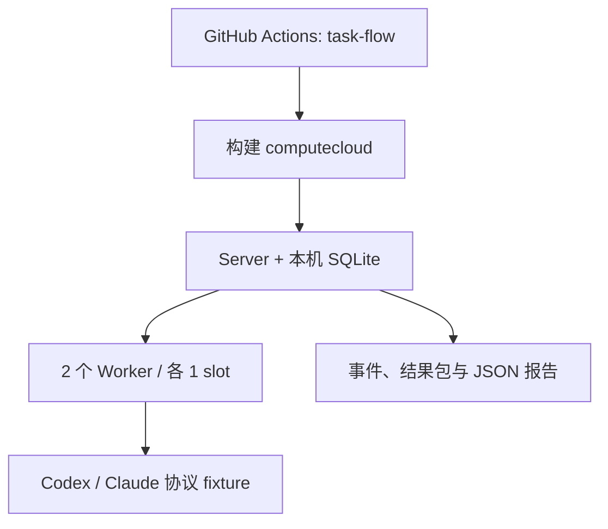
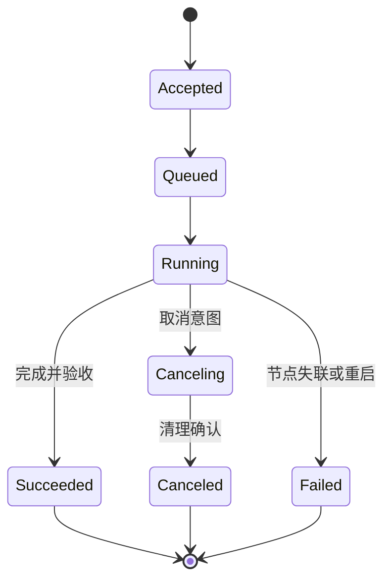

# CI 任务执行流程模拟

本文定义一条不使用真实模型账号的端到端 CI 流程。它启动真实 `computecloud` Server/Worker 进程，通过协议 fixture 模拟 Codex 与 Claude CLI，验证从任务投递到产物归档、取消和故障恢复的完整控制面行为。

这条流程验证调度协议与状态机，不代表真实模型质量、供应商兼容性、跨主机网络或生产容量已经验收。

## 1. 拓扑与数据流



所有 Token、SQLite、Git 仓库和 Worker 工作区都位于 CI 临时目录。fixture 不访问网络模型服务，不读取环境中的模型凭据。测试完成后先停止 Worker，再停止 Server；日志和脱敏报告保存为 workflow artifact。

## 2. 单次运行流程

| 阶段 | 触发动作 | 预期状态与证据 |
| --- | --- | --- |
| 1. 集群就绪 | 启动一个 Server、两个 Worker，读取 capabilities | 两节点在线；声明 `single`、`map_reduce`；模板摘要已登记 |
| 2. single Job | 使用同一幂等键提交两次 Codex fixture Job | 返回相同 Job ID；一个 Task 成功；事件连续；结果包哈希正确 |
| 3. Map/Reduce | Codex 与 Claude 各执行一个 Map，Codex 执行 Reduce | 两个 Map、一个 Reduce 全部成功；Map 可跨 Worker；最终报告包可下载 |
| 4. 取消 | 提交慢 Job，等待 RUNNING 后调用 cancel | 先保存取消意图；Job 最终为 CANCELED；fixture 子进程已停止 |
| 5. Worker 故障 | 运行慢 Job，SIGKILL 所在 Worker，再启动同一 Worker | 原执行不重放；Job 明确 FAILED；错误为 `WORKER_RESTARTED` 或 `WORKER_LOST`；子进程已清理 |
| 6. 关闭与存储检查 | 顺序停止节点并打开 Server 数据库 | `PRAGMA integrity_check=ok`；Job 汇总为 2 成功、1 取消、1 失败 |

任务的主状态流如下：



Map/Reduce Job 只有在全部 Map 成功并确认产物后才创建唯一 Reduce。CI 会记录每个阶段的 Worker 分配、Job/Attempt ID、事件数量、最终产物 SHA-256 和 tar 成员。

## 3. GitHub Actions 实现

`.github/workflows/ci.yml` 中的 `task-flow` Job 与常规 `verify` 并行运行：

1. checkout 并安装固定 Go 版本；
2. 执行 `go mod verify`；
3. 运行 `make ci-flow`；
4. 无论成功失败都上传 `dist/ci-task-flow/`；
5. `package` 同时依赖 `verify` 与 `task-flow`，端到端流程失败时不生成候选发布包。

artifact 名称为 `ci-task-flow-<run_id>`，保留 30 天，包含：

```text
dist/ci-task-flow/
├── report.json
└── logs/
    ├── server.log
    ├── worker-a.log
    └── worker-b.log
```

`report.json` 使用 `ci-task-flow.v1`，每个步骤包含 `status`、持续时间和可核查 evidence。失败时仍写出已完成步骤、错误和日志尾部，CI 命令随后返回非零状态。

## 4. 本地复现

需要 Linux、Git、Python 3.12+ 和项目规定的 Go 工具链：

```sh
make ci-flow
python3 -m json.tool dist/ci-task-flow/report.json
```

单次 fixture 流程通常在十几秒内结束。若需要容量数据，另运行 `make capacity-check` 或 `make capacity`；端到端流程只验证确定性状态语义，不把吞吐量作为通过门槛。

## 5. 通过与未覆盖边界

CI 通过意味着真实二进制、HTTP/gRPC 客户端、SQLite、调度循环、Worker 子进程、事件、产物和清理路径在同一 Linux runner 上协同成功。以下仍须在目标环境单独执行：

- 真实 Codex/Claude CLI 登录、模型输出与费用；
- TLS、独立主机、网络中断和防火墙；
- MCP 由真实 Codex 发起的调用；
- Responses 上游兼容、SSE 和账单对照；
- 生产仓库 verifier、生产数据规模和长期稳定性。

真实环境验收继续使用[正式部署指南](../deployment/production-v0.2.md)、[容量与部署验收](capacity.md)和[多节点 PoC](multi-node-poc.md)，不得以 fixture artifact 替代。
